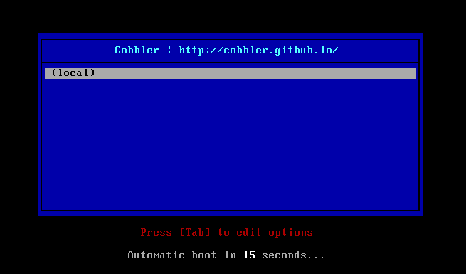
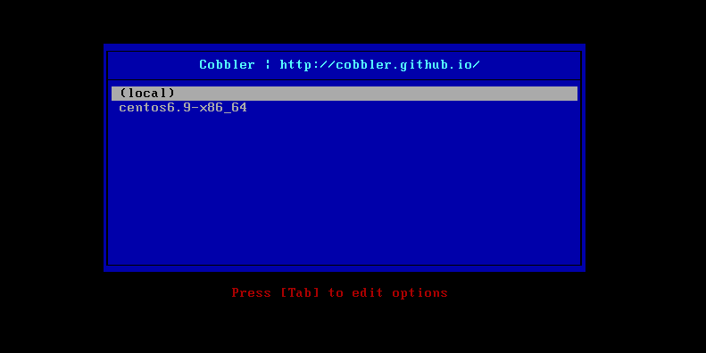
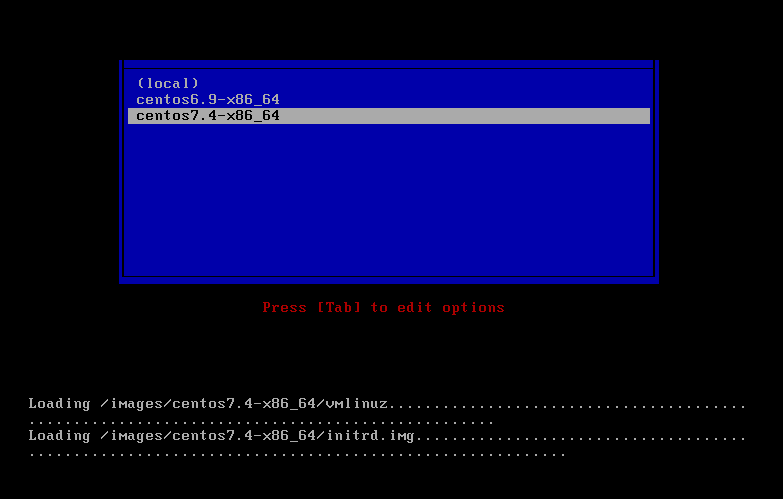
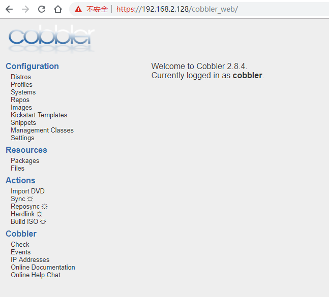

## cobbler简介
>`Cobbler` 可以用来快速建立 `Linux` 网络安装环境，它已将`Linux`网络安装的技术门槛，从大专以上文化水平，成功降低到了初中水平，连补鞋匠都能学会。
>网络安装服务器套件`Cobbler`（补鞋匠）从前，我们一直在装机民工这份很有前途的职业。自打若干年前`Red Hat`推出了 `Kickstart`，此后我们顿觉身价增倍。不再需要刻了光盘一台一台的安装`Linux`，只要搞定`PXE`、`DHCP`、`TFTP`，还有那满屏眼花缭乱不知所云的`Kickstart`脚本，我们就可以像哈利波特一样，轻点魔棒，瞬间安装上百台服务器。这一堆花里胡哨的东西可不是一般人能够整明白的，没有大专以上的学历，通不过英语四级，根本别想玩转。总而言之，这是一份多么有前途，多么有技术含量的工作啊。很不幸，`Red Ha`t 最新（`Cobbler`项目最初在`2008`年左右发布）发布了网络安装服务器套件`Cobbler`（补鞋匠），它已将`Linux`网络安装的技术门槛，从大专以上文化水平，成功降低到初中以下水平，连补鞋匠都能学会。

>1、`Cobbler`是一个`Linux`服务器安装的服务，可以通过网络启动（`PXE`）的方式来快速安装、重装物理服务器和虚拟机，同时还可以管理`DHCP`，`DNS`等。
>2、`Cobbler`可以使用命令行方式管理，也提供了基于Web的界面管理工具（`cobbler-web`），还提供了`API`接口，可以方便二次开发使用。
>3、`Cobbler`是较早前的`kickstart`的升级版，优点是比较容易配置，还自带web界面比较易于管理。
>4、`Cobbler`内置了一个轻量级配置管理系统，但它也支持和其它配置管理系统集成，如`Puppet`。

**参考网站**

[cobbler官网](http://cobbler.github.io/)

[Kickstart文件编写参考](https://www.linuxidc.com/Linux/2017-08/146168.htm)

## cobbler对应关系


> `Cobbler`的配置结构基于一组注册的对象。每个对象表示一个与另一个实体相关联的实体。当一个对象指向另一个对象时，它就继承了被指向对象的数据，并可覆盖或添加更多特定信息。
- 发行版(`distros`)： 表示一个操作系统。它承载了内核和`initrd`的信息，以及内核参数等其他数据。
- 配置文件(`profiles`)：包含一个发行版、一个`kickstart`文件以及可能的存储库，还包括更多特定的内核参数等其他数据。
- 系统(`systems`)：表示要配给的机器。它包括一个配置文件或一个镜像、`IP`和`MAC`地址、电源管理（地址、凭据、类型）以及更为专业的数据等信息。
- 镜像(`images`)：可以替换一个保函不屑于此类别的文件的发行版对象（例如，无法分为内核和`initrd`的对象）。

## cobbler集成的服务
- PXE服务支持
- DHCP服务管理
- DNS服务管理
- 电源管理
- Kickstart服务支持
- YUM仓库管理
- TFTP
- Apache

## cobbler工作原理


**Server端**

- 启动`Cobbler`服务
- 进行`Cobbler`错误检查，执行`cobbler check`命令
- 进行配置同步，执行`cobbler syn`c命令
- 复制相关启动文件到`TFTP`目录中
- 启动`DHCP`服务，提供地址分配
- `DHCP`服务分配IP地址
- `TFTP`传输启动文件
- `Server`端接收安装信息
- `Server`端发送`ISO`镜像与`Kickstart`文件

**Client端**

- 客户端以`PXE`模式启动
- 客户端获取`IP`地址
- 通过`TFTP`服务器获取启动文件
- 进入`Cobbler`安装选择界面
- 根据配置信息准备安装系统
- 加载`Kickstart`文件
- 传输系统安装的其它文件
- 进行安装系统

## cobbler安装

>说明：虚拟机网卡采用NAT模式，不要使用桥接模式，因为后面会搭建DHCP服务器，在同一个局域网多个DHCP服务会有冲突。
>VMware的NAT模式的dhcp服务也关闭，避免干扰。
>

### 环境准备
```
# 关闭防火墙、selinux等
[root@cobbler ~]# systemctl stop firewalld
[root@cobbler ~]# systemctl disable firewalld
[root@cobbler ~]# setenforce 0
[root@cobbler ~]# sed -i 's/^SELINUX=.*/SELINUX=disabled/' /etc/sysconfig/selinux
```
### 安装cobbler
```
# 配置epel源
[root@cobbler ~]# yum -y install epel-release

# 安装cobbler及dhcp httpd xinetd cobbler-web
[root@cobbler ~]# yum -y install cobbler cobbler-web tftp-server dhcp httpd xinetd

# 启动cobbler及httpd并加入开机启动
[root@cobbler ~]# systemctl start httpd cobblerd
[root@cobbler ~]# systemctl enable httpd cobblerd
```
查看安装后相关文件
```
[root@cobbler ~]# rpm -ql cobbler
/etc/cobbler                  # 配置文件目录
/etc/cobbler/settings         # cobbler主配置文件，这个文件是YAML格式，Cobbler是python写的程序。
/etc/cobbler/dhcp.template    # DHCP服务的配置模板
/etc/cobbler/tftpd.template   # tftp服务的配置模板
/etc/cobbler/rsync.template   # rsync服务的配置模板
/etc/cobbler/iso              # iso模板配置文件目录
/etc/cobbler/pxe              # pxe模板文件目录
/etc/cobbler/power            # 电源的配置文件目录
/etc/cobbler/users.conf       # Web服务授权配置文件
/etc/cobbler/users.digest     # 用于web访问的用户名密码配置文件
/etc/cobbler/dnsmasq.template # DNS服务的配置模板
/etc/cobbler/modules.conf     # Cobbler模块配置文件
/var/lib/cobbler              # Cobbler数据目录
/var/lib/cobbler/config       # 配置文件
/var/lib/cobbler/kickstarts   # 默认存放kickstart文件
/var/lib/cobbler/loaders      # 存放的各种引导程序
/var/www/cobbler              # 系统安装镜像目录
/var/www/cobbler/ks_mirror    # 导入的系统镜像列表
/var/www/cobbler/images       # 导入的系统镜像启动文件
/var/www/cobbler/repo_mirror  # yum源存储目录
/var/log/cobbler              # 日志目录
/var/log/cobbler/install.log  # 客户端系统安装日志
/var/log/cobbler/cobbler.log  # cobbler日志
```
### 配置cobbler
> 检查`Cobbler`的配置，如果看不到下面的结果，再次重启`cobbler`

```
[root@cobbler ~]# cobbler check
The following are potential configuration items that you may want to fix:

1 : The 'server' field in /etc/cobbler/settings must be set to something other than localhost, or kickstarting features will not work.  This should be a resolvable hostname or IP for the boot server as reachable by all machines that will use it.
2 : For PXE to be functional, the 'next_server' field in /etc/cobbler/settings must be set to something other than 127.0.0.1, and should match the IP of the boot server on the PXE network.
3 : change 'disable' to 'no' in /etc/xinetd.d/tftp
4 : Some network boot-loaders are missing from /var/lib/cobbler/loaders, you may run 'cobbler get-loaders' to download them, or, if you only want to handle x86/x86_64 netbooting, you may ensure that you have installed a *recent* version of the syslinux package installed and can ignore this message entirely.  Files in this directory, should you want to support all architectures, should include pxelinux.0, menu.c32, elilo.efi, and yaboot. The 'cobbler get-loaders' command is the easiest way to resolve these requirements.
5 : enable and start rsyncd.service with systemctl
6 : debmirror package is not installed, it will be required to manage debian deployments and repositories
7 : ksvalidator was not found, install pykickstart
8 : The default password used by the sample templates for newly installed machines (default_password_crypted in /etc/cobbler/settings) is still set to 'cobbler' and should be changed, try: "openssl passwd -1 -salt 'random-phrase-here' 'your-password-here'" to generate new one
9 : fencing tools were not found, and are required to use the (optional) power management features. install cman or fence-agents to use them

Restart cobblerd and then run 'cobbler sync' to apply changes.
```
> 看到上面出现的问题，然后一个一个的进行解决，先进行设置为可以动态配置，也可以直接更改配置文件。

```
# 设置可以动态修改配置文件
[root@cobbler ~]# sed -ri '/allow_dynamic_settings:/c\allow_dynamic_settings: 1' /etc/cobbler/settings
[root@cobbler ~]# grep allow_dynamic_settings /etc/cobbler/settings 
allow_dynamic_settings: 1
[root@cobbler ~]# systemctl restart cobblerd
```
逐个解决上面的问题
```
1. server
[root@cobbler ~]# cobbler setting edit --name=server --value=192.168.2.128

2. next_server
[root@cobbler ~]# cobbler setting edit --name=next_server --value=192.168.2.128

3. tftp_server
[root@cobbler ~]# sed -ri '/disable/c\disable = no' /etc/xinetd.d/tftp
[root@cobbler ~]# systemctl enable xinetd
[root@cobbler ~]# systemctl restart xinetd

4. boot-loaders
[root@cobbler ~]# cobbler get-loaders

5. rsyncd
[root@cobbler ~]# systemctl start rsyncd
[root@cobbler ~]# systemctl enable rsyncd

6. debmirror [optional]
# 这个是可选项的，可以忽略。这里就忽略了

7. pykickstart
[root@cobbler ~]# yum -y install pykickstart

8. default_password_crypted  #注意：这里设置的密码，也就是后面安装完系统的初始化登录密码
[root@cobbler ~]# openssl passwd -1 -salt `openssl rand -hex 4` 'admin'
$1$675f1d08$oJoAMVxdbdKHjQXbGqNTX0
[root@cobbler ~]# cobbler setting edit --name=default_password_crypted --value='$1$675f1d08$oJoAMVxdbdKHjQXbGqNTX0'

9. fencing tools [optional]
[root@cobbler ~]# yum -y install fence-agents
```
解决完成再次查看
```
[root@cobbler ~]# cobbler check
The following are potential configuration items that you may want to fix:

1 : debmirror package is not installed, it will be required to manage debian deployments and repositories

Restart cobblerd and then run 'cobbler sync' to apply changes.
```
### 配置DHCP
```
[root@cobbler ~]# cobbler setting edit --name=manage_dhcp --value=1

# 修改cobbler的dhcp模块，不要直接修改dhcp本身的配置文件，因为cobbler会覆盖
[root@cobbler ~]# vim /etc/cobbler/dhcp.template
...
subnet 192.168.2.0 netmask 255.255.255.0 { #这里改为分配的网段和掩码
     #option routers             192.168.1.5; #如果有网关，这里改为网关地址
     #option domain-name-servers 192.168.1.1; #如果有DNS，这里改为DNS地址
     option subnet-mask         255.255.255.0; #改为分配的IP的掩码
     range dynamic-bootp        192.168.2.100 192.168.2.254; #改为分配的IP的范围
...
```
### 同步cobbler配置
>同步cobbler配置，它会根据配置自动修改dhcp等服务。

```
[root@cobbler ~]# cobbler rsync 
No such command: rsync
[root@cobbler ~]# cobbler sync
task started: 2019-06-12_152623_sync
task started (id=Sync, time=Wed Jun 12 15:26:23 2019)
running pre-sync triggers
cleaning trees
removing: /var/www/cobbler/images/centos6.9-x86_64
removing: /var/lib/tftpboot/pxelinux.cfg/default
removing: /var/lib/tftpboot/grub/images
removing: /var/lib/tftpboot/grub/grub-x86.efi
removing: /var/lib/tftpboot/grub/grub-x86_64.efi
removing: /var/lib/tftpboot/grub/efidefault
removing: /var/lib/tftpboot/images/centos6.9-x86_64
removing: /var/lib/tftpboot/s390x/profile_list
copying bootloaders
trying hardlink /var/lib/cobbler/loaders/grub-x86.efi -> /var/lib/tftpboot/grub/grub-x86.efi
trying hardlink /var/lib/cobbler/loaders/grub-x86_64.efi -> /var/lib/tftpboot/grub/grub-x86_64.efi
copying distros to tftpboot
copying files for distro: centos6.9-x86_64
trying hardlink /var/www/cobbler/ks_mirror/centos6.9-x86_64/images/pxeboot/vmlinuz -> /var/lib/tftpboot/images/centos6.9-x86_64/vmlinuz
trying hardlink /var/www/cobbler/ks_mirror/centos6.9-x86_64/images/pxeboot/initrd.img -> /var/lib/tftpboot/images/centos6.9-x86_64/initrd.img
copying images
generating PXE configuration files
generating PXE menu structure
copying files for distro: centos6.9-x86_64
trying hardlink /var/www/cobbler/ks_mirror/centos6.9-x86_64/images/pxeboot/vmlinuz -> /var/www/cobbler/images/centos6.9-x86_64/vmlinuz
trying hardlink /var/www/cobbler/ks_mirror/centos6.9-x86_64/images/pxeboot/initrd.img -> /var/www/cobbler/images/centos6.9-x86_64/initrd.img
Writing template files for centos6.9-x86_64
rendering DHCP files
generating /etc/dhcp/dhcpd.conf
rendering TFTPD files
generating /etc/xinetd.d/tftp
processing boot_files for distro: centos6.9-x86_64
cleaning link caches
running post-sync triggers
running python triggers from /var/lib/cobbler/triggers/sync/post/*
running python trigger cobbler.modules.sync_post_restart_services
running: dhcpd -t -q
received on stdout: 
received on stderr: 
running: service dhcpd restart
received on stdout: 
received on stderr: Redirecting to /bin/systemctl restart dhcpd.service

running shell triggers from /var/lib/cobbler/triggers/sync/post/*
running python triggers from /var/lib/cobbler/triggers/change/*
running python trigger cobbler.modules.manage_genders
running python trigger cobbler.modules.scm_track
running shell triggers from /var/lib/cobbler/triggers/change/*
*** TASK COMPLETE ***
```
这时候创建一个新虚拟机可以获取到如下信息，没有镜像选择，只能从本地启动


### cobbler命令帮助
| 命令             | 说明                                       |
| ---------------- | :----------------------------------------- |
| cobbler check    | 核对当前设置是否有问题                     |
| cobbler list     | 列出所有的cobbler元素                      |
| cobbler report   | 列出元素的详细信息                         |
| cobbler sync     | 同步配置到数据目录，更改配置最好都执行一下 |
| cobbler reposync | 同步yum仓库                                |
| cobbler distro   | 查看导入的发行版系统信息                   |
| cobbler system   | 查看添加的系统信息                         |
| cobbler profile  | 查看配置信息                               |

## cobbler配置安装centos6.x
>由于我这里实在`centos7`系统上面配置的`cobbler`，所以上传了一个`centos6`的镜像并进行挂载。

1）创建挂载点，并进行挂载
```
[root@cobbler ~]# mkdir /centos6
[root@cobbler ~]# mount -o loop CentOS-6.9-x86_64-bin-DVD1.iso /centos6
```
2）查看挂载后的目录
```
[root@cobbler ~]# ls /centos6/
CentOS_BuildTag  images                    repodata                       RPM-GPG-KEY-CentOS-Testing-6
EFI              isolinux                  RPM-GPG-KEY-CentOS-6           TRANS.TBL
EULA             Packages                  RPM-GPG-KEY-CentOS-Debug-6
GPL              RELEASE-NOTES-en-US.html  RPM-GPG-KEY-CentOS-Security-6
```
3）导入镜像
```
[root@cobbler ~]# cobbler import --path=/centos6 --name=centos6.9 --arch=x86_64
# --path 镜像路径
# --name 为安装源定义一个名字
# --arch 指定安装源是32位、64位、ia64, 目前支持的选项有: x86│x86_64│ia64
# 安装源的唯一标示就是根据name参数来定义，本例导入成功后，安装源的唯一标示就是：centos6.9，如果重复，系统会提示导入失败。
```
4）查看导入后镜像信息
```
[root@cobbler ~]# cobbler distro report --name=centos6.9-x86_64
Name                           : centos6.9-x86_64
Architecture                   : x86_64
TFTP Boot Files                : {}
Breed                          : redhat
Comment                        : 
Fetchable Files                : {}
Initrd                         : /var/www/cobbler/ks_mirror/centos6.9-x86_64/images/pxeboot/initrd.img
Kernel                         : /var/www/cobbler/ks_mirror/centos6.9-x86_64/images/pxeboot/vmlinuz
Kernel Options                 : {}
Kernel Options (Post Install)  : {}
Kickstart Metadata             : {'tree': 'http://@@http_server@@/cblr/links/centos6.9-x86_64'}
Management Classes             : []
OS Version                     : rhel6
Owners                         : ['admin']
Red Hat Management Key         : <<inherit>>
Red Hat Management Server      : <<inherit>>
Template Files                 : {}
```
5）查看`profile`信息
```
[root@cobbler ~]# cobbler profile report --name=centos6.9-x86_64
Name                           : centos6.9-x86_64
TFTP Boot Files                : {}
Comment                        : 
DHCP Tag                       : default
Distribution                   : centos6.9-x86_64
Enable gPXE?                   : 0
Enable PXE Menu?               : 1
Fetchable Files                : {}
Kernel Options                 : {}
Kernel Options (Post Install)  : {}
Kickstart                      : /var/lib/cobbler/kickstarts/sample_end.ks
Kickstart Metadata             : {}
Management Classes             : []
Management Parameters          : <<inherit>>
Name Servers                   : []
Name Servers Search Path       : []
Owners                         : ['admin']
Parent Profile                 : 
Internal proxy                 : 
Red Hat Management Key         : <<inherit>>
Red Hat Management Server      : <<inherit>>
Repos                          : []
Server Override                : <<inherit>>
Template Files                 : {}
Virt Auto Boot                 : 1
Virt Bridge                    : xenbr0
Virt CPUs                      : 1
Virt Disk Driver Type          : raw
Virt File Size(GB)             : 5
Virt Path                      : 
Virt RAM (MB)                  : 512
Virt Type                      : kvm
```
6）`copy`一份`profile`文件(`ks`)，进行修改
```
[root@cobbler ~]# cd /var/lib/cobbler/kickstarts/
[root@cobbler kickstarts]# ls
default.ks    install_profiles  sample_autoyast.xml  sample_esxi4.ks  sample.ks
esxi4-ks.cfg  legacy.ks         sample_end.ks        sample_esxi5.ks  sample_old.seed
esxi5-ks.cfg  pxerescue.ks      sample_esx4.ks       sample_esxi6.ks  sample.seed
[root@cobbler kickstarts]# cp sample_end.ks centos6.ks

# 编辑centos6的kickstart文件
[root@cobbler kickstarts]# vim centos6.ks 
# This kickstart file should only be used with EL > 5 and/or Fedora > 7.
# For older versions please use the sample.ks kickstart file.
# Install OS instead of upgrade
install
# Use text mode install
text
# System keyboard
keyboard us
# System language
lang en_US
# System timezone
timezone  Asia/ShangHai
#Root password
rootpw --iscrypted $default_password_crypted
# System authorization information
auth  --useshadow  --enablemd5
# Firewall configuration
firewall --disabled
# SELinux configuration
selinux --disabled
# Use network installation
url --url=$tree

# Clear the Master Boot Record
zerombr
# System bootloader configuration
bootloader --location=mbr
# Partition clearing information
clearpart --all --initlabel
part /boot --fstype=ext4 --size=500
part swap --fstype=swap --size=2048
part / --fstype=ext4 --grow --size=200 

# If any cobbler repo definitions were referenced in the kickstart profile, include them here.
$yum_repo_stanza
# Network information
$SNIPPET('network_config')
# Do not configure the X Window System
skipx
# Run the Setup Agent on first boot
firstboot --disable
# Reboot after installation
reboot


%pre
$SNIPPET('log_ks_pre')
$SNIPPET('kickstart_start')
$SNIPPET('pre_install_network_config')
# Enable installation monitoring
$SNIPPET('pre_anamon')
%end

%packages
$SNIPPET('func_install_if_enabled')
@core
@base
tree
nmap
wget
lftp
lrzsz
telnet
%end

%post --nochroot
$SNIPPET('log_ks_post_nochroot')
%end

%post
$SNIPPET('log_ks_post')
# Start yum configuration
$yum_config_stanza
# End yum configuration
$SNIPPET('post_install_kernel_options')
$SNIPPET('post_install_network_config')
$SNIPPET('func_register_if_enabled')
$SNIPPET('download_config_files')
$SNIPPET('koan_environment')
$SNIPPET('redhat_register')
$SNIPPET('cobbler_register')
# Enable post-install boot notification
$SNIPPET('post_anamon')
# Start final steps
$SNIPPET('kickstart_done')
# End final steps

sed -ri "/^#UseDNS/c\UseDNS no" /etc/ssh/sshd_config
sed -ri "/^GSSAPIAuthentication/c\GSSAPIAuthentication no" /etc/ssh/sshd_config
%end
```
7）编辑`centos6`镜像所使用的`kickstart`文件
```
# 动态编辑指定使用新的kickstart文件
[root@cobbler ~]# cobbler profile edit --name=centos6.9-x86_64 --kickstart=/var/lib/cobbler/kickstarts/centos6.ks

# 验证是否更改成功
[root@cobbler ~]# cobbler profile report --name=centos6.9-x86_64 |grep Kickstart
Kickstart                      : /var/lib/cobbler/kickstarts/centos6.ks
```
8）再次同步`cobbler`配置
```
[root@cobbler ~]# cobbler sync
```
9）新建虚拟机进行测试

选择`centos6.9`进行安装，会按照`kickstart`文件安装并启动


## cobbler配置安装centos7.x
>我这里cobbler服务器就是7的系统，所以直接挂载/dev/cdrom即可

1）创建挂载点，并进行挂载
```
[root@cobbler ~]# mkdir /centos7
[root@cobbler ~]# mount -o loop /dev/cdrom /centos7
```
2）查看挂载后的目录
```
[root@cobbler ~]# ls /centos7/
CentOS_BuildTag  EULA  images    LiveOS    repodata              RPM-GPG-KEY-CentOS-Testing-7
EFI              GPL   isolinux  Packages  RPM-GPG-KEY-CentOS-7  TRANS.TBL
```
3）导入镜像
```
[root@cobbler ~]# cobbler import --path=/centos7 --name=centos7.4 --arch=x86_64
task started: 2019-06-12_165812_import
task started (id=Media import, time=Wed Jun 12 16:58:12 2019)
Found a candidate signature: breed=redhat, version=rhel6
Found a candidate signature: breed=redhat, version=rhel7
Found a matching signature: breed=redhat, version=rhel7
Adding distros from path /var/www/cobbler/ks_mirror/centos7.4-x86_64:
creating new distro: centos7.4-x86_64
trying symlink: /var/www/cobbler/ks_mirror/centos7.4-x86_64 -> /var/www/cobbler/links/centos7.4-x86_64
creating new profile: centos7.4-x86_64
associating repos
checking for rsync repo(s)
checking for rhn repo(s)
checking for yum repo(s)
starting descent into /var/www/cobbler/ks_mirror/centos7.4-x86_64 for centos7.4-x86_64
processing repo at : /var/www/cobbler/ks_mirror/centos7.4-x86_64
need to process repo/comps: /var/www/cobbler/ks_mirror/centos7.4-x86_64
looking for /var/www/cobbler/ks_mirror/centos7.4-x86_64/repodata/*comps*.xml
Keeping repodata as-is :/var/www/cobbler/ks_mirror/centos7.4-x86_64/repodata
*** TASK COMPLETE ***
```
4）查看导入后镜像信息
```
[root@cobbler ~]# cobbler distro report --name=centos7.4-x86_64
Name                           : centos7.4-x86_64
Architecture                   : x86_64
TFTP Boot Files                : {}
Breed                          : redhat
Comment                        : 
Fetchable Files                : {}
Initrd                         : /var/www/cobbler/ks_mirror/centos7.4-x86_64/images/pxeboot/initrd.img
Kernel                         : /var/www/cobbler/ks_mirror/centos7.4-x86_64/images/pxeboot/vmlinuz
Kernel Options                 : {}
Kernel Options (Post Install)  : {}
Kickstart Metadata             : {'tree': 'http://@@http_server@@/cblr/links/centos7.4-x86_64'}
Management Classes             : []
OS Version                     : rhel7
Owners                         : ['admin']
Red Hat Management Key         : <<inherit>>
Red Hat Management Server      : <<inherit>>
Template Files                 : {}
```
5）查看`profile`信息
```
[root@cobbler ~]# cobbler profile report --name=centos7.4-x86_64
Name                           : centos7.4-x86_64
TFTP Boot Files                : {}
Comment                        : 
DHCP Tag                       : default
Distribution                   : centos7.4-x86_64
Enable gPXE?                   : 0
Enable PXE Menu?               : 1
Fetchable Files                : {}
Kernel Options                 : {}
Kernel Options (Post Install)  : {}
Kickstart                      : /var/lib/cobbler/kickstarts/sample_end.ks
Kickstart Metadata             : {}
Management Classes             : []
Management Parameters          : <<inherit>>
Name Servers                   : []
Name Servers Search Path       : []
Owners                         : ['admin']
Parent Profile                 : 
Internal proxy                 : 
Red Hat Management Key         : <<inherit>>
Red Hat Management Server      : <<inherit>>
Repos                          : []
Server Override                : <<inherit>>
Template Files                 : {}
Virt Auto Boot                 : 1
Virt Bridge                    : xenbr0
Virt CPUs                      : 1
Virt Disk Driver Type          : raw
Virt File Size(GB)             : 5
Virt Path                      : 
Virt RAM (MB)                  : 512
Virt Type                      : kvm
```
7）`copy`一份`profile`文件( `ks` )，进行修改,这里直接copy上面6的了，然后修改修改即可
```
[root@cobbler ~]# cd /var/lib/cobbler/kickstarts/
[root@cobbler kickstarts]# cp centos6.ks centos7.ks

# 编辑centos7的kickstart文件
[root@cobbler kickstarts]# vim centos7.ks
# This kickstart file should only be used with EL > 5 and/or Fedora > 7.
# For older versions please use the sample.ks kickstart file.
# Install OS instead of upgrade
install
# Use text mode install
text
# System keyboard
keyboard us
# System language
lang en_US
# System timezone
timezone  Asia/ShangHai
#Root password
rootpw --iscrypted $default_password_crypted
# System authorization information
auth  --useshadow  --enablemd5
# Firewall configuration
firewall --disabled
# SELinux configuration
selinux --disabled
# Use network installation
url --url=$tree

# Clear the Master Boot Record
zerombr
# System bootloader configuration
bootloader --location=mbr
# Partition clearing information
clearpart --all --initlabel
part /boot --fstype=xfs --size=500
part swap --fstype=swap --size=2048
part / --fstype=xfs --grow --size=200 

# If any cobbler repo definitions were referenced in the kickstart profile, include them here.
$yum_repo_stanza
# Network information
$SNIPPET('network_config')
# Do not configure the X Window System
skipx
# Run the Setup Agent on first boot
firstboot --disable
# Reboot after installation
reboot


%pre
$SNIPPET('log_ks_pre')
$SNIPPET('kickstart_start')
$SNIPPET('pre_install_network_config')
# Enable installation monitoring
$SNIPPET('pre_anamon')
%end

%packages
$SNIPPET('func_install_if_enabled')
@core
@base
tree
nmap
wget
lftp
lrzsz
telnet
%end

%post --nochroot
$SNIPPET('log_ks_post_nochroot')
%end

%post
$SNIPPET('log_ks_post')
# Start yum configuration
$yum_config_stanza
# End yum configuration
$SNIPPET('post_install_kernel_options')
$SNIPPET('post_install_network_config')
$SNIPPET('func_register_if_enabled')
$SNIPPET('download_config_files')
$SNIPPET('koan_environment')
$SNIPPET('redhat_register')
$SNIPPET('cobbler_register')
# Enable post-install boot notification
$SNIPPET('post_anamon')
# Start final steps
$SNIPPET('kickstart_done')
# End final steps

sed -ri "/^#UseDNS/c\UseDNS no" /etc/ssh/sshd_config
sed -ri "/^GSSAPIAuthentication/c\GSSAPIAuthentication no" /etc/ssh/sshd_config
%end
```
7）编辑`centos7`镜像所使用的`kickstart`文件
```
# 动态编辑指定使用新的kickstart文件
[root@cobbler ~]# cobbler profile edit --name=centos7.4-x86_64 --kickstart=/var/lib/cobbler/kickstarts/centos7.ks

# 验证是否更改成功
[root@cobbler ~]# cobbler profile report --name=centos7.4-x86_64 |grep Kickstart
Kickstart                      : /var/lib/cobbler/kickstarts/centos7.ks
```
8）再次同步`cobbler`配置
```
[root@cobbler ~]# cobbler sync
```
9）新建虚拟机进行测试

选择`centos7.4`进行安装即可


>说明：在`client`端系统安装时，可以在`cobbler`服务端上查看日志`/var/log/messages`，观察安装的每一个`cobbler`流程

## cobbler Web管理界面配置
> `web`界面有很多功能，包括上传镜像、编辑`kickstart`、等等很多在命令行操作的都可以在`web`界面直接操作。
> 在上面已经安装了`cobbler-web`软件，访问地址：https://IP/cobbler_web即可。默认账号为`cobbler`，密码也为`cobbler`



**修改密码**
```
/etc/cobbler/users.conf     #Web服务授权配置文件
/etc/cobbler/users.digest   #用于web访问的用户名密码

[root@cobbler ~]# cat /etc/cobbler/users.digest 
cobbler:Cobbler:a2d6bae81669d707b72c0bd9806e01f3

# 设置密码，在Cobbler组添加cobbler用户，输入2遍密码确
[root@cobbler ~]# htdigest /etc/cobbler/users.digest "Cobbler" cobbler
Changing password for user cobbler in realm Cobbler
New password: superman
Re-type new password: superman

# 同步配置并重启httpd、cobbler
[root@cobbler ~]# cobbler sync
[root@cobbler ~]# systemctl restart httpd
[root@cobbler ~]# systemctl restart cobblerd
```
再次登录即使用新设置的密码登录即可。


