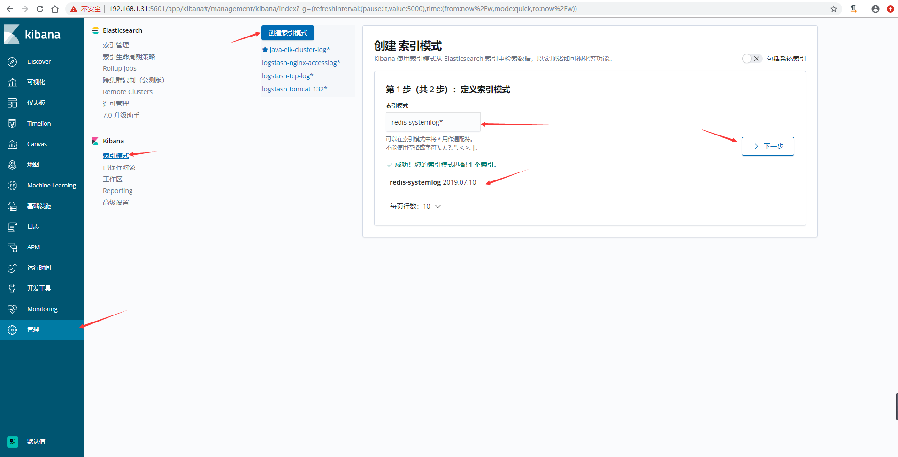
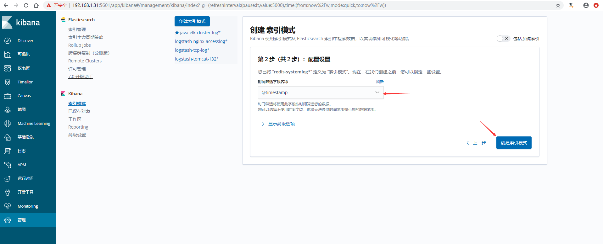

>用一台服务器部署`redis`服务，专门用于日志缓存使用，一般用于`web`服务器产生大量日志的场景。
>
>这里是使用一台专门用于部署`redis` ，一台专门部署了`logstash`，在`linux-elk1`ELK集群上面进行日志收集存到了`redis`服务器上面，然后通过专门的`logstash`服务器去`redis`服务器里面取出数据在放到`kibana`上面进行展示


## 部署redis

### 下载安装redis
```
[root@linux-redis ~]# wget http://download.redis.io/releases/redis-5.0.0.tar.gz
[root@linux-redis ~]# tar -xvzf redis-5.0.0.tar.gz
[root@linux-redis ~]# mv redis-5.0.0 /usr/local/src/
[root@linux-redis ~]# ln -sv /usr/local/src/redis-5.0.0 /usr/local/redis
"/usr/local/redis" -> "/usr/local/src/redis-5.0.0"
[root@linux-redis ~]# cd /usr/local/redis/
[root@linux-redis ~]# make distclean
[root@linux-redis ~]# make
```


### 配置redis
```
[root@linux-redis redis]# vim redis.conf
daemonize yes
bind 192.168.1.30
requirepass 123321

[root@linux-redis redis]# cp /usr/local/redis/src/redis-server /usr/bin/
[root@linux-redis redis]# cp /usr/local/redis/src/redis-cli /usr/bin/
[root@linux-redis redis]# redis-server /usr/local/redis/redis.conf 
4007:C 10 Jul 2019 12:24:30.367 # oO0OoO0OoO0Oo Redis is starting oO0OoO0OoO0Oo
4007:C 10 Jul 2019 12:24:30.367 # Redis version=5.0.0, bits=64, commit=00000000, modified=0, pid=4007, just started
4007:C 10 Jul 2019 12:24:30.367 # Configuration loaded

[root@linux-redis redis]# netstat -nlutp |grep 6379
tcp        0      0 192.168.1.30:6379       0.0.0.0:*               LISTEN      4008/redis-server 1
```


### 测试redis
```
[root@linux-redis redis]# redis-cli -h 192.168.1.30
192.168.1.30:6379> AUTH 123321
OK
192.168.1.30:6379> ping
PONG
192.168.1.30:6379> KEYS *
(empty list or set)
192.168.1.30:6379> quit
```


## 配置logstash将日志写入redis
>将系统日志的通过`logstash`收集之后写入`redis`，然后通过另外的`logstash`将`redis`服务器的数据取出来。

### 配置logstash的配置文件
```
[root@linux-elk1 ~]# vim /etc/logstash/conf.d/system.conf
input {
    file {
        path => "/var/log/messages"
        type => "systemlog"
        start_position => "beginning"
        stat_interval => "2"
    }
}

output {
    if [type] == "systemlog" {
        redis {
            data_type => "list"
            host => "192.168.1.30"
            password => "123321"
            port => "6379"
            db => "0"
            key => "systemlog"
        }
    }
}
```
### 检查logstash配置语法是否正确
```
[root@linux-elk1 ~]# /usr/share/logstash/bin/logstash -f /etc/logstash/conf.d/system.conf -t
WARNING: Could not find logstash.yml which is typically located in $LS_HOME/config or /etc/logstash. You can specify the path using --path.settings. Continuing using the defaults
Could not find log4j2 configuration at path /usr/share/logstash/config/log4j2.properties. Using default config which logs errors to the console
[WARN ] 2019-07-10 14:46:46.324 [LogStash::Runner] multilocal - Ignoring the 'pipelines.yml' file because modules or command line options are specified
Configuration OK

[root@linux-elk1 ~]# systemctl restart logstash
```
### 写入messages日志测试
```
[root@linux-elk1 ~]# echo "redis-test" >> /var/log/messages
[root@linux-elk1 ~]# echo "systemlog" >> /var/log/messages
```
### 登录redis进行查看
```
[root@linux-redis ~]# redis-cli -h 192.168.1.30
192.168.1.30:6379> AUTH 123321
OK
192.168.1.30:6379> SELECT 0
OK
192.168.1.30:6379> KEYS *
1) "systemlog"
192.168.1.30:6379> LLEN systemlog
(integer) 126
```


## 配置logstash从redis中取出数据到elasticsearch
>配置专门`logstash`服务器从`redis`服务器读取指定的`key`的数据，并写入到`elasticsearch`

### 编辑logstash配置文件
```
[root@logstash ~]# vim /etc/logstash/conf.d/redis-read.conf
input {
    redis {
        data_type => "list"
        host => "192.168.1.30"
        password => "123321"
        port => "6379"
        db => "0"
        key => "systemlog"
    }
}

output {
    elasticsearch {
        hosts => ["192.168.1.31:9200"]
        index => "redis-systemlog-%{+YYYY.MM.dd}"
    }
}
```

### 测试logstash配置是否正确
```
[root@logstash ~]# /usr/share/logstash/bin/logstash -f /etc/logstash/conf.d/redis-read.conf -t
OpenJDK 64-Bit Server VM warning: If the number of processors is expected to increase from one, then you should configure the number of parallel GC threads appropriately using -XX:ParallelGCThreads=N
WARNING: Could not find logstash.yml which is typically located in $LS_HOME/config or /etc/logstash. You can specify the path using --path.settings. Continuing using the defaults
Could not find log4j2 configuration at path /usr/share/logstash/config/log4j2.properties. Using default config which logs errors to the console
[INFO ] 2019-07-10 16:41:50.576 [main] writabledirectory - Creating directory {:setting=>"path.queue", :path=>"/usr/share/logstash/data/queue"}
[INFO ] 2019-07-10 16:41:50.649 [main] writabledirectory - Creating directory {:setting=>"path.dead_letter_queue", :path=>"/usr/share/logstash/data/dead_letter_queue"}
[WARN ] 2019-07-10 16:41:51.498 [LogStash::Runner] multilocal - Ignoring the 'pipelines.yml' file because modules or command line options are specified
Configuration OK

[root@logstash ~]# systemctl restart logstash
```

### 验证redis的数据是否被取出
```
[root@linux-redis ~]# redis-cli -h 192.168.1.30
192.168.1.30:6379> AUTH 123321
OK
192.168.1.30:6379> SELECT 0
OK
192.168.1.30:6379> KEYS *
(empty list or set)     #这里数据已经为空
192.168.1.30:6379> SELECT 1
OK
192.168.1.30:6379[1]> KEYS *
(empty list or set)     #这里数据已经为空
```
### head插件上验证数据


### kibana界面创建索引模式并查看数据




