## 说明
>这里的环境接着上面的ELK快速入门-基本部署文章继续下面的操作。


## 收集多个日志文件
1）`logstash`配置文件编写
```
[root@linux-elk1 ~]# vim /etc/logstash/conf.d/system-log.conf
input {
    file {
        path => "/var/log/messages"
        type => "systemlog"
        start_position => "beginning"
        stat_interval => "3"
    }
    file {
        path => "/var/log/secure"
        type => "securelog"
        start_position => "beginning"
        stat_interval => "3"
    }
}

output {
    if [type] == "systemlog" { 
        elasticsearch {
            hosts => ["192.168.1.31:9200"]
            index => "system-log-%{+YYYY.MM.dd}"
        }
    }
    if [type] == "securelog" { 
        elasticsearch {
            hosts => ["192.168.1.31:9200"]
            index => "secure-log-%{+YYYY.MM.dd}"
        }
    }
}
```
2）给日志文件赋予可读权限并重启`logstash`
```
[root@linux-elk1 ~]# chmod 644 /var/log/secure 
[root@linux-elk1 ~]# chmod 644 /var/log/messages
[root@linux-elk1 ~]# systemctl restart logstash
```
3）向被收集的文件中写入数据；是为了马上能在`elasticsearch`的`web`界面和`klbana`的`web`界面里面查看到数据。
```
[root@linux-elk1 ~]# echo "test" >> /var/log/secure 
[root@linux-elk1 ~]# echo "test" >> /var/log/messages
```
4）在`kibana`界面添加`system-log`索引模式

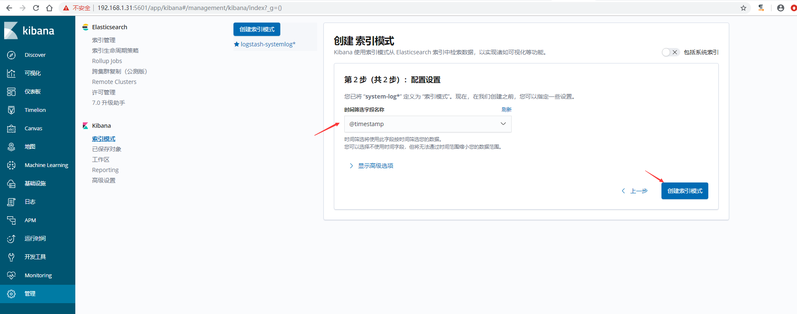
5）在`kibana`界面添加`secure-log`索引模式


6）`kibana`查看日志


## 收集tomcat和java日志
>收集`Tomcat`服务器的访问日志以及`Tomcat`错误日志进行实时统计，在`kibana`页面进行搜索展示，每台`Tomcat`服务器需要安装`logstash`负责收集日志，然后将日志发给`elasticsearch`进行分析，在通过`kibana`在前端展示。

### 部署tomcat服务
>说明，我这里在`linux-elk2`节点上面装`tomcat`

1）下载并安装`tomcat`
```
[root@linux-elk2 ~]# cd /usr/local/
[root@linux-elk2 local]# wget http://mirrors.tuna.tsinghua.edu.cn/apache/tomcat/tomcat-9/v9.0.21/bin/apache-tomcat-9.0.21.tar.gz
[root@linux-elk2 local]# tar xvzf apache-tomcat-9.0.21.tar.gz
[root@linux-elk2 local]# ln -s /usr/local/apache-tomcat-9.0.21 /usr/local/tomcat
```
2）测试页面准备
```
[root@linux-elk2 local]# cd /usr/local/tomcat/webapps/
[root@linux-elk2 webapps]# mkdir webdir
[root@linux-elk2 webapps]# echo "<h1>Welcome to Tomcat</h1>"  > /usr/local/tomcat/webapps/webdir/index.html
```
3）`tomcat`日志转`json`
```
[root@linux-elk2 tomcat]# vim /usr/local/tomcat/conf/server.xml
        <Valve className="org.apache.catalina.valves.AccessLogValve" directory="logs"
               prefix="localhost_access_log" suffix=".txt"
               pattern="{&quot;clientip&quot;:&quot;%h&quot;,&quot;ClientUser&quot;:&quot;%l&quot;,&quot;authenticated&quot;:&quot;%u&quot;,&quot;AccessTime&quot;:&quot;%t&quot;,&quot;method&quot;:&quot;%r&quot;,&quot;status&quot;:&quot;%s&quot;,&quot;SendBytes&quot;:&quot;%b&quot;,&quot;Query?string&quot;:&quot;%q&quot;,&quot;partner&quot;:&quot;%{Referer}i&quot;,&quot;AgentVersion&quot;:&quot;%{User-Agent}i&quot;}"/>
```
4）启动`tomcat`，并进行访问测试生成日志
```
[root@linux-elk2 tomcat]# /usr/local/tomcat/bin/startup.sh
[root@linux-elk2 tomcat]# ss -nlt |grep 8080
LISTEN     0      100         :::8080                    :::*
[root@linux-elk2 tomcat]# ab -n100 -c100 http://192.168.1.32:8080/webdir/

[root@linux-elk2 ~]# tailf /usr/local/tomcat/logs/localhost_access_log.2019-07-05.log 
{"clientip":"192.168.1.32","ClientUser":"-","authenticated":"-","AccessTime":"[05/Jul/2019:16:39:18 +0800]","method":"GET /webdir/ HTTP/1.0","status":"200","SendBytes":"27","Query?string":"","partner":"-","AgentVersion":"ApacheBench/2.3"}
{"clientip":"192.168.1.32","ClientUser":"-","authenticated":"-","AccessTime":"[05/Jul/2019:16:39:18 +0800]","method":"GET /webdir/ HTTP/1.0","status":"200","SendBytes":"27","Query?string":"","partner":"-","AgentVersion":"ApacheBench/2.3"}
{"clientip":"192.168.1.32","ClientUser":"-","authenticated":"-","AccessTime":"[05/Jul/2019:16:39:18 +0800]","method":"GET /webdir/ HTTP/1.0","status":"200","SendBytes":"27","Query?string":"","partner":"-","AgentVersion":"ApacheBench/2.3"}
{"clientip":"192.168.1.32","ClientUser":"-","authenticated":"-","AccessTime":"[05/Jul/2019:16:39:18 +0800]","method":"GET /webdir/ HTTP/1.0","status":"200","SendBytes":"27","Query?string":"","partner":"-","AgentVersion":"ApacheBench/2.3"}
{"clientip":"192.168.1.32","ClientUser":"-","authenticated":"-","AccessTime":"[05/Jul/2019:16:39:18 +0800]","method":"GET /webdir/ HTTP/1.0","status":"200","SendBytes":"27","Query?string":"","partner":"-","AgentVersion":"ApacheBench/2.3"}
{"clientip":"192.168.1.32","ClientUser":"-","authenticated":"-","AccessTime":"[05/Jul/2019:16:39:18 +0800]","method":"GET /webdir/ HTTP/1.0","status":"200","SendBytes":"27","Query?string":"","partner":"-","AgentVersion":"ApacheBench/2.3"}
{"clientip":"192.168.1.32","ClientUser":"-","authenticated":"-","AccessTime":"[05/Jul/2019:16:39:18 +0800]","method":"GET /webdir/ HTTP/1.0","status":"200","SendBytes":"27","Query?string":"","partner":"-","AgentVersion":"ApacheBench/2.3"}
{"clientip":"192.168.1.32","ClientUser":"-","authenticated":"-","AccessTime":"[05/Jul/2019:16:39:18 +0800]","method":"GET /webdir/ HTTP/1.0","status":"200","SendBytes":"27","Query?string":"","partner":"-","AgentVersion":"ApacheBench/2.3"}
```
5）验证日志是否为`json`格式，http://www.kjson.com/
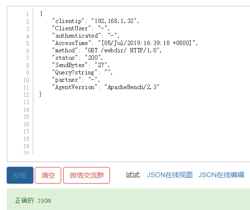

### 配置logstash收集tomcat日志
>说明：如果是需要收集别的服务器上面的`tomcat`日志，那么在所需要收集的服务器上面都得安装`logstash`。此处是在`linux-elk2`节点上面部署的`tomcat`，之前安装过`logstash`。

1）配置`logstash`
```
[root@linux-elk2 ~]# vim /etc/logstash/conf.d/tomcat.conf
input {
    file {
        path => "/usr/local/tomcat/logs/localhost_access_log.*.log"
        type => "tomcat-access-log"
        start_position => "beginning"
        stat_interval => "2"
    }
}

output {
    elasticsearch {
        hosts => ["192.168.1.31:9200"]
        index => "logstash-tomcat-132-accesslog-%{+YYYY.MM.dd}"
    }
    file {
        path => "/tmp/logstash-tomcat-132-accesslog-%{+YYYY.MM.dd}"
    }
}
```
2）检测配置文件语法，并重启`logstash`
```
[root@linux-elk2 ~]# /usr/share/logstash/bin/logstash -f /etc/logstash/conf.d/tomcat.conf -tWARNING: Could not find logstash.yml which is typically located in $LS_HOME/config or /etc/logstash. You can specify the path using --path.settings. Continuing using the defaults
Could not find log4j2 configuration at path /usr/share/logstash/config/log4j2.properties. Using default config which logs errors to the console
[WARN ] 2019-07-05 17:04:34.583 [LogStash::Runner] multilocal - Ignoring the 'pipelines.yml' file because modules or command line options are specified
Configuration OK

[root@linux-elk2 ~]# /usr/share/logstash/bin/system-install /etc/logstash/startup.options systemd
[root@linux-elk2 ~]# systemctl start logstash
```
3）权限修改，不然`elasticsearch`界面和`kibana`界面是无法查看到的
```
[root@linux-elk2 ~]# ll /usr/local/tomcat/logs/ -d
drwxr-xr-x 2 root root 197 7月   5 16:36 /usr/local/tomcat/logs/
[root@linux-elk2 ~]# ll /usr/local/tomcat/logs/
总用量 64
-rw-r----- 1 root root 14228 7月   5 16:36 catalina.2019-07-05.log
-rw-r----- 1 root root 14228 7月   5 16:36 catalina.out
-rw-r----- 1 root root     0 7月   5 16:25 host-manager.2019-07-05.log
-rw-r----- 1 root root  1074 7月   5 16:36 localhost.2019-07-05.log
-rw-r----- 1 root root 26762 7月   5 17:23 localhost_access_log.2019-07-05.log
-rw-r----- 1 root root     0 7月   5 16:25 manager.2019-07-05.log
[root@linux-elk2 ~]# chown logstash.logstash /usr/local/tomcat/logs/ -R
[root@linux-elk2 ~]# ll /usr/local/tomcat/logs/
总用量 64
-rw-r----- 1 logstash logstash 14228 7月   5 16:36 catalina.2019-07-05.log
-rw-r----- 1 logstash logstash 14228 7月   5 16:36 catalina.out
-rw-r----- 1 logstash logstash     0 7月   5 16:25 host-manager.2019-07-05.log
-rw-r----- 1 logstash logstash  1074 7月   5 16:36 localhost.2019-07-05.log
-rw-r----- 1 logstash logstash 26762 7月   5 17:23 localhost_access_log.2019-07-05.log
-rw-r----- 1 logstash logstash     0 7月   5 16:25 manager.2019-07-05.log
```
4）访问`elasticsearch`界面验证插件

数据浏览
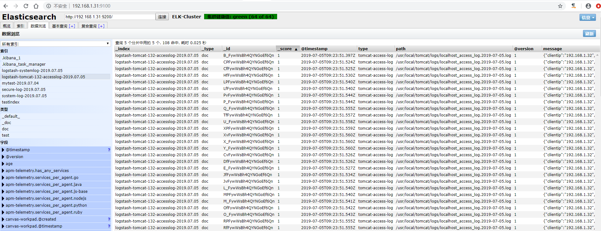

5）在`kibana`上添加索引模式
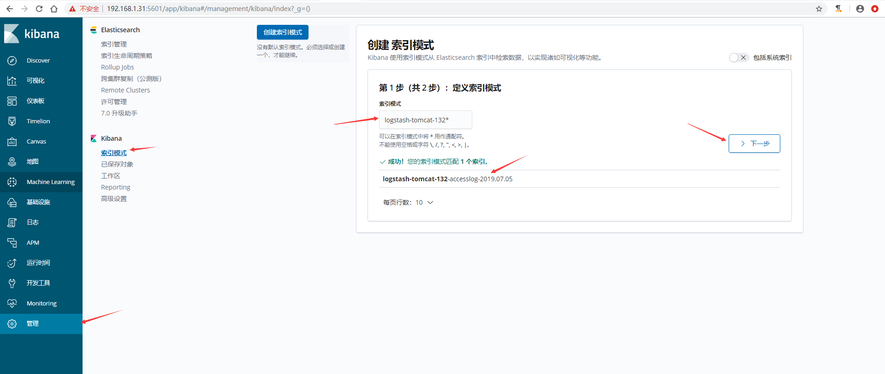
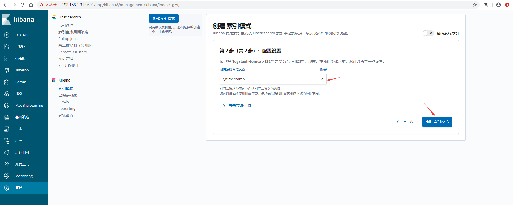
6）`kibana`验证数据


### 配置logstash收集java日志
>使用codec的multiline插件实现多行匹配，这是一个可以将多行进行合并的插件，而且可以使用what指定将匹配到的行与前面的行合并还是和后面的行合并，https://www.elastic.co/guide/en/logstash/current/plugins-codecs-multiline.html

语法格式：
```
input {
    stdin {
        codec => multiline {
            pattern => "^\["    #当遇到[开头的行时候将多行进行合并
            negate => true      #true为匹配成功进行操作，false为不成功进行操
            what => "previous"  #与上面的行合并，如果是下面的行合并就是
        }
    }
}
```
命令行测试输入输出：
```
[root@linux-elk2 ~]# /usr/share/logstash/bin/logstash -e 'input { stdin { codec => multiline { pattern => "^\[" negate => true what => "previous" } } } output { stdout { codec => rubydebug }}'
WARNING: Could not find logstash.yml which is typically located in $LS_HOME/config or /etc/logstash. You can specify the path using --path.settings. Continuing using the defaults
Could not find log4j2 configuration at path /usr/share/logstash/config/log4j2.properties. Using default config which logs errors to the console
[WARN ] 2019-07-08 15:28:04.938 [LogStash::Runner] multilocal - Ignoring the 'pipelines.yml' file because modules or command line options are specified
[INFO ] 2019-07-08 15:28:04.968 [LogStash::Runner] runner - Starting Logstash {"logstash.version"=>"6.8.1"}
[INFO ] 2019-07-08 15:28:19.167 [Converge PipelineAction::Create<main>] pipeline - Starting pipeline {:pipeline_id=>"main", "pipeline.workers"=>1, "pipeline.batch.size"=>125, "pipeline.batch.delay"=>50}
[INFO ] 2019-07-08 15:28:19.918 [Converge PipelineAction::Create<main>] pipeline - Pipeline started successfully {:pipeline_id=>"main", :thread=>"#<Thread:0xc8dd9a1 run>"}
The stdin plugin is now waiting for input:
111111
222222
aaaaaa
[44444
{
    "@timestamp" => 2019-07-08T07:34:48.063Z,
          "tags" => [
        [0] "multiline"
    ],
      "@version" => "1",
       "message" => "[12\n111111\n222222\naaaaaa",
          "host" => "linux-elk2.exmaple.com"
}

444444
aaaaaa
[77777
{
    "@timestamp" => 2019-07-08T07:35:51.522Z,
          "tags" => [
        [0] "multiline"
    ],
      "@version" => "1",
       "message" => "[44444\n444444\naaaaaa",
          "host" => "linux-elk2.exmaple.com"
}
```
**示例：收集ELK集群日志**
1）观察日志文件，`elk`集群日志都是以`"["`开头并且每一个信息都是如此。
```
[root@linux-elk2 ~]# tailf /elk/logs/ELK-Cluster.log 
[2019-07-08T11:26:37,774][INFO ][o.e.c.m.MetaDataIndexTemplateService] [elk-node2] adding template [kibana_index_template:.kibana] for index patterns [.kibana]
[2019-07-08T11:26:47,664][INFO ][o.e.c.m.MetaDataIndexTemplateService] [elk-node2] adding template [kibana_index_template:.kibana] for index patterns [.kibana]
[2019-07-08T11:33:55,150][INFO ][o.e.c.m.MetaDataIndexTemplateService] [elk-node2] adding template [kibana_index_template:.kibana] for index patterns [.kibana]
[2019-07-08T11:33:55,197][INFO ][o.e.c.m.MetaDataMappingService] [elk-node2] [.kibana_1/yRee-8HYS8KiVwnuADXAbA] update_mapping [doc]
[2019-07-08T11:33:55,822][INFO ][o.e.c.m.MetaDataIndexTemplateService] [elk-node2] adding template [kibana_index_template:.kibana] for index patterns [.kibana]
[2019-07-08T11:33:55,905][INFO ][o.e.c.m.MetaDataMappingService] [elk-node2] [.kibana_1/yRee-8HYS8KiVwnuADXAbA] update_mapping [doc]
[2019-07-08T11:33:57,026][INFO ][o.e.c.m.MetaDataIndexTemplateService] [elk-node2] adding template [kibana_index_template:.kibana] for index patterns [.kibana]
[2019-07-08T11:43:20,262][WARN ][o.e.m.j.JvmGcMonitorService] [elk-node2] [gc][young][8759][66] duration [1.3s], collections [1]/[1.7s], total [1.3s]/[4s], memory [176mb]->[111.6mb]/[1.9gb], all_pools {[young] [64.8mb]->[706.4kb]/[66.5mb]}{[survivor] [3.3mb]->[3mb]/[8.3mb]}{[old] [107.8mb]->[107.8mb]/[1.9gb]}
[2019-07-08T11:43:20,388][WARN ][o.e.m.j.JvmGcMonitorService] [elk-node2] [gc][8759] overhead, spent [1.3s] collecting in the last [1.7s]
[2019-07-08T11:44:42,955][INFO ][o.e.x.m.p.NativeController] [elk-node2] Native controller process has stopped - no new native processes can be started
```
2）配置`logstash`
```
[root@linux-elk2 ~]# vim /etc/logstash/conf.d/java.conf
input {
    file {
        path => "/elk/logs/ELK-Cluster.log"
        type => "java-elk-cluster-log"
        start_position => "beginning"
        stat_interval => "2"
        code => multiline {
            pattern => "^\["    #以"["开头进行正则匹配，匹配规则
            negate => "true"  #正则匹配成功，false匹配不成功
            what => "previous"  #和前面的内容进行合并,如果是和下面的合并就是next
        }
    }
}

output {
    if [type] == "java-elk-cluster-log" {
        elasticsearch {
            hosts => ["192.168.1.31:9200"]
            index => "java-elk-cluster-log-%{+YYYY.MM.dd}"
        }
    }
}
```
3）检查配置文件语法是否有误并重启`logstash`
```
[root@linux-elk2 ~]# /usr/share/logstash/bin/logstash -f /etc/logstash/conf.d/java.conf -t
WARNING: Could not find logstash.yml which is typically located in $LS_HOME/config or /etc/logstash. You can specify the path using --path.settings. Continuing using the defaults
Could not find log4j2 configuration at path /usr/share/logstash/config/log4j2.properties. Using default config which logs errors to the console
[WARN ] 2019-07-08 15:49:51.996 [LogStash::Runner] multilocal - Ignoring the 'pipelines.yml' file because modules or command line options are specified
Configuration OK
[INFO ] 2019-07-08 15:50:04.438 [LogStash::Runner] runner - Using config.test_and_exit mode. Config Validation Result: OK. Exiting Logstash

[root@linux-elk2 ~]# systemctl restart logstash
```
4）访问`elasticsearch`界面验证数据
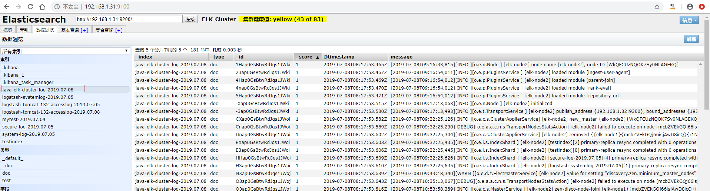
5）在`kibana`上添加索引验证模式

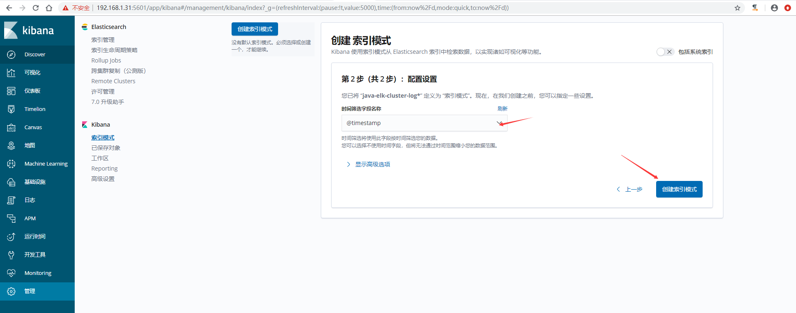
6）`kibana`验证数据


## 收集Nginx访问日志
>收集`nginx`的`json`访问日志，这里为了测试，是在一台新的服务器上面安装了`nginx`和`logstash`

1）安装nginx并准备一个测试页面
```
[root@node01 ~]# yum -y install nginx
[root@node01 ~]# echo "<h1>whelcom to nginx server</h1>" > /usr/share/nginx/html/index.html
[root@node01 ~]# systemctl start nginx 
[root@node01 ~]# curl localhost
<h1>whelcom to nginx server</h1>
```
2）将nginx日志转换成json格式
```
[root@node01 ~]# vim /etc/nginx/nginx.conf
    log_format access_json '{"@timestamp":"$time_iso8601",'
                           '"host":"$server_addr",'
                           '"clientip":"$remote_addr",'
                           '"size":$body_bytes_sent,'
                           '"responsetime":$request_time,'
                           '"upstreamtime":"$upstream_response_time",'
                           '"upstreamhost":"$upstream_addr",'
                           '"http_host":"$host",'
                           '"url":"$uri",'
                           '"domain":"$host",'
                           '"xff":"$http_x_forwarded_for",'
                           '"referer":"$http_referer",'
                           '"status":"$status"}';

    access_log  /var/log/nginx/access.log  access_json;

[root@node01 ~]# nginx -t
nginx: the configuration file /etc/nginx/nginx.conf syntax is ok
nginx: configuration file /etc/nginx/nginx.conf test is successful
[root@node01 ~]# systemctl restart nginx
```
3）访问一次，确认日志为`json`格式


```
[root@node01 ~]# tail /var/log/nginx/access.log
{"@timestamp":"2019-07-09T11:21:28+08:00","host":"192.168.1.30","clientip":"192.168.1.144","size":33,"responsetime":0.000,"upstreamtime":"-","upstreamhost":"-","http_host":"192.168.1.30","url":"/index.html","domain":"192.168.1.30","xff":"-","referer":"-","status":"200"}
```
4）安装`logstash`并配置收集`nginx`日志
```
#将logstash软件包copy到nginx服务器上
[root@linux-elk1 ~]# scp logstash-6.8.1.rpm 192.168.1.30:/root/
#安装logstash
[root@node01 ~]# yum -y localinstall logstash-6.8.1.rpm
#生成logstash.service启动文件
[root@node01 ~]# /usr/share/logstash/bin/system-install /etc/logstash/startup.options systemd
#将logstash启动用户更改为root，不然可能会导致收集不到日志
[root@node01 ~]# vim /etc/systemd/system/logstash.service
User=root
Group=root
[root@node01 ~]# systemctl daemon-reload

[root@node01 ~]# vim /etc/logstash/conf.d/nginx.conf
input {
    file {
        path => "/var/log/nginx/access.log"
        type => "nginx-accesslog"
        start_position => "beginning"
        stat_interval => "2"
        codec => json
    }
}

output {
    if [type] == "nginx-accesslog" {
        elasticsearch {
        hosts => ["192.168.1.31:9200"]
        index => "logstash-nginx-accesslog-30-%{+YYYY.MM.dd}"
        }
    }
}
```
5）检查配置文件语法是否有误并重启`logstash`
```
[root@node01 ~]# /usr/share/logstash/bin/logstash -f /etc/logstash/conf.d/nginx.conf -t
WARNING: Could not find logstash.yml which is typically located in $LS_HOME/config or /etc/logstash. You can specify the path using --path.settings. Continuing using the defaults
Could not find log4j2 configuration at path /usr/share/logstash/config/log4j2.properties. Using default config which logs errors to the console
[WARN ] 2019-07-09 11:26:04.277 [LogStash::Runner] multilocal - Ignoring the 'pipelines.yml' file because modules or command line options are specified
Configuration OK
[INFO ] 2019-07-09 11:26:09.055 [LogStash::Runner] runner - Using config.test_and_exit mode. Config Validation Result: OK. Exiting Logstash

[root@node01 ~]# systemctl restart logstash
```

6）在`kibana`上添加索引验证模式

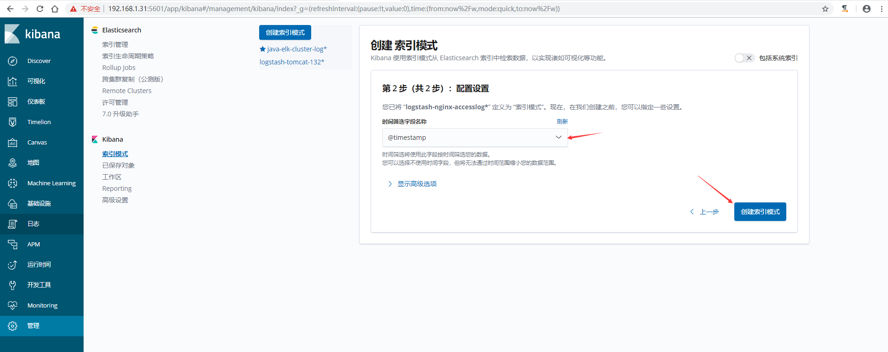

7）在`kibana`上验证数据,可以通过添加筛选，让日志更加了然名目


## 收集TCP/UDP日志
>通过`logstash`的`tcp/udp`插件收集日志，通常用于在向`elasticsearch`日志补录丢失的部分日志，可以将丢失的日志通过一个`TCP`端口直接写入到`elasticsearch`服务器。

### 进行收集测试
1）logstash配置
```
[root@linux-elk1 ~]# vim /etc/logstash/conf.d/tcp.conf
input {
    tcp {
        port => 9889
        type => "tcplog"
        mode => "server"
    }
}

output {
    stdout {
        codec => rubydebug
    }
}
```
2）验证端口是否启动成功
```
[root@linux-elk1 ~]# /usr/share/logstash/bin/logstash -f /etc/logstash/conf.d/tcp.conf 
WARNING: Could not find logstash.yml which is typically located in $LS_HOME/config or /etc/logstash. You can specify the path using --path.settings. Continuing using the defaults
Could not find log4j2 configuration at path /usr/share/logstash/config/log4j2.properties. Using default config which logs errors to the console
[WARN ] 2019-07-09 18:12:07.538 [LogStash::Runner] multilocal - Ignoring the 'pipelines.yml' file because modules or command line options are specified
[INFO ] 2019-07-09 18:12:07.551 [LogStash::Runner] runner - Starting Logstash {"logstash.version"=>"6.8.1"}
[INFO ] 2019-07-09 18:12:14.416 [Converge PipelineAction::Create<main>] pipeline - Starting pipeline {:pipeline_id=>"main", "pipeline.workers"=>2, "pipeline.batch.size"=>125, "pipeline.batch.delay"=>50}
[INFO ] 2019-07-09 18:12:14.885 [Converge PipelineAction::Create<main>] pipeline - Pipeline started successfully {:pipeline_id=>"main", :thread=>"#<Thread:0x240c27a6 sleep>"}
[INFO ] 2019-07-09 18:12:14.911 [[main]<tcp] tcp - Starting tcp input listener {:address=>"0.0.0.0:9889", :ssl_enable=>"false"}
[INFO ] 2019-07-09 18:12:14.953 [Ruby-0-Thread-1: /usr/share/logstash/lib/bootstrap/environment.rb:6] agent - Pipelines running {:count=>1, :running_pipelines=>[:main], :non_running_pipelines=>[]}
[INFO ] 2019-07-09 18:12:15.223 [Api Webserver] agent - Successfully started Logstash API endpoint {:port=>9600}


# 新开一个终端验证端口
[root@linux-elk1 ~]# netstat -nlutp |grep 9889
tcp6       0      0 :::9889                 :::*                    LISTEN      112455/java
```
3）在别的服务器通过nc命令进行测试，查看logstash是否收到数据
```

# echo "nc test" | nc 192.168.1.31 9889    #在另外一台服务器上执行

# 在上面启动logstash的那个终端查看
{
       "message" => "nc test",
          "host" => "192.168.1.30",
          "type" => "tcplog",
      "@version" => "1",
    "@timestamp" => 2019-07-09T10:16:48.139Z,
          "port" => 37102
}
```
4）通过nc命令发送一个文件，查看logstash收到的数据
```
# nc 192.168.1.31 9889 < /etc/passwd    #同样在上面执行nc那台服务器上执行

# 同样还是在上面启动logstash的那个终端查看
{
       "message" => "mysql:x:27:27:MariaDB Server:/var/lib/mysql:/sbin/nologin",
          "host" => "192.168.1.30",
          "type" => "tcplog",
      "@version" => "1",
    "@timestamp" => 2019-07-09T10:18:29.186Z,
          "port" => 37104
}
{
       "message" => "logstash:x:989:984:logstash:/usr/share/logstash:/sbin/nologin",
          "host" => "192.168.1.30",
          "type" => "tcplog",
      "@version" => "1",
    "@timestamp" => 2019-07-09T10:18:29.187Z,
          "port" => 37104
}
```
5）通过伪设备的方式发送消息：
在类Unix操作系统中，设备节点并不一定要对应物理设备。没有这种对应关系的设备是伪设备。操作系统运用了它们提供的多种功能，tcp只是dev下面众多伪设备当中的一种设备。
```
# echo "伪设备" >/dev/tcp/192.168.1.31/9889    #同样在上面执行nc那台服务器上执行

# 同样还是在上面启动logstash的那个终端查看
{
       "message" => "伪设备",
          "host" => "192.168.1.30",
          "type" => "tcplog",
      "@version" => "1",
    "@timestamp" => 2019-07-09T10:21:32.487Z,
          "port" => 37106
}
```
6）将输出更改到elasticsearch
```
[root@linux-elk1 ~]# vim /etc/logstash/conf.d/tcp.conf
input {
    tcp {
        port => 9889
        type => "tcplog"
        mode => "server"
    }
}

output {
    elasticsearch {
        hosts => ["192.168.1.31:9200"]
        index => "logstash-tcp-log-%{+YYYY.MM.dd}"
    }
}
```
7）通过nc命令或伪设备输入日志
```
# echo "伪设备 1" >/dev/tcp/192.168.1.31/9889
# echo "伪设备 2" >/dev/tcp/192.168.1.31/9889
```
8）在kibana界面创建索引模式
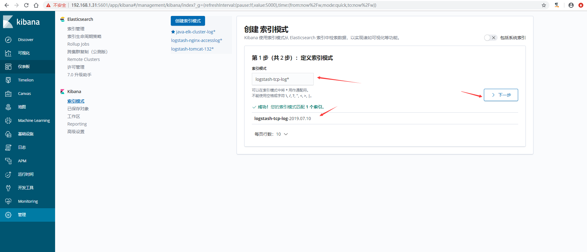
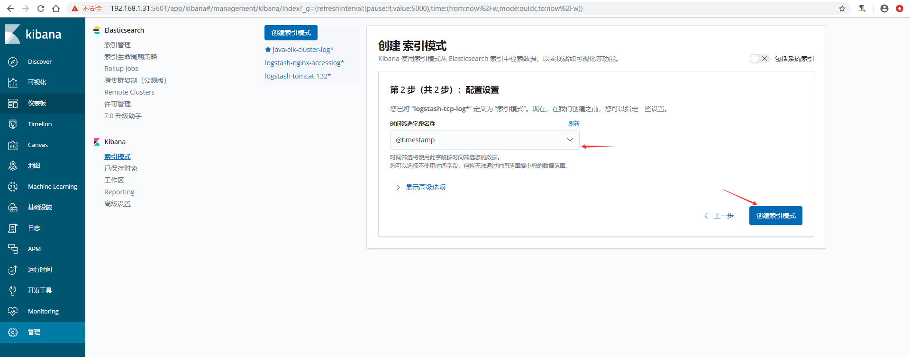
9）验证数据
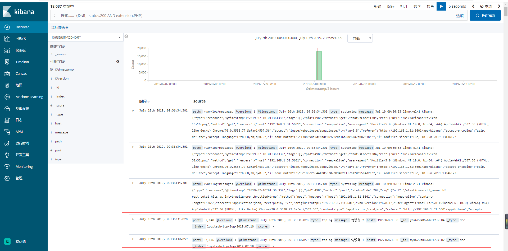


