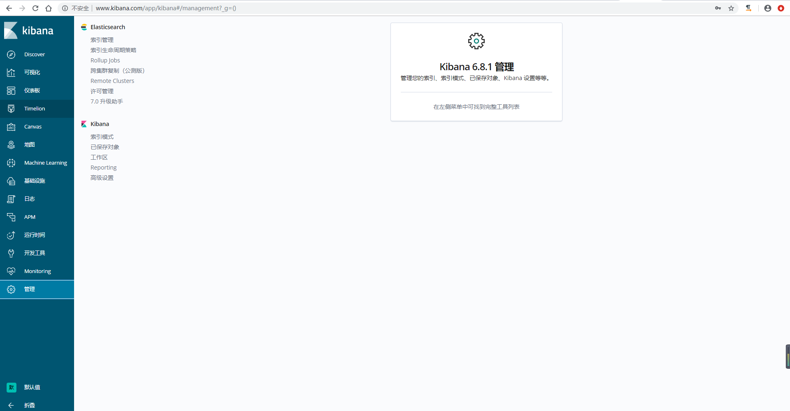

>由于`kibana`界面默认没有安全认证界面，为了保证安全，通过`nginx`进行代理并设置访问认证。

## 配置kibana
```
[root@linux-elk1 ~]# vim /etc/kibana/kibana.yml
server.host: "127.0.0.1"    #将监听地址更改为127.0.0.1
[root@linux-elk1 ~]# systemctl restart kibana
[root@linux-elk1 ~]# netstat -nlutp |grep 5601
tcp        0      0 127.0.0.1:5601          0.0.0.0:*               LISTEN      72068/node
```


## 部署nginx
1）安装`nginx`
```
[root@linux-elk1 ~]# yum -y install nginx httpd-tools
```
2）配置`nginx`
```
[root@linux-elk1 ~]# vim /etc/nginx/conf.d/kibana.conf
upstream kibana_server {
    server 127.0.0.1:5601 weight=1 max_fails=3 fail_timeout=60;
}

server {
    listen 80;
    server_name www.kibana.com;
    auth_basic "Restricted Access";
    auth_basic_user_file /etc/nginx/conf.d/htpasswd.users;
    location / {
        proxy_pass http://kibana_server;
        proxy_http_version 1.1;
        proxy_set_header Upgrade $http_upgrade;
        proxy_set_header Connection 'upgrade';
        proxy_set_header Host $host;
        proxy_cache_bypass $http_upgrade;
    }
}

[root@linux-elk1 ~]# htpasswd -bc /etc/nginx/conf.d/htpasswd.users admin 123456
Adding password for user admin
[root@linux-elk1 ~]# cat /etc/nginx/conf.d/htpasswd.users
admin:$apr1$ro5tQZp9$grhByziZtm3ZpZCsSFzsQ1
[root@linux-elk1 ~]# systemctl start nginx
```
3）`windows`上添加`hosts`, 路径`C:\Windows\System32\drivers\etc\hosts`
```
192.168.1.31	www.kibana.com
```
4）测试验证




