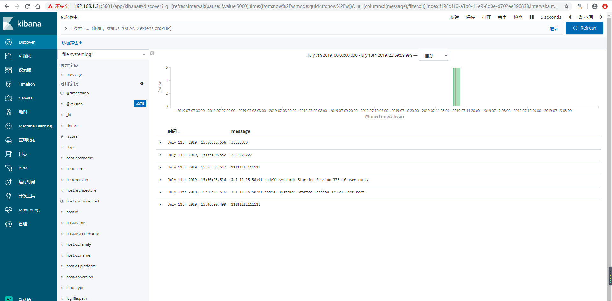

## filebeat简介
>`Filebeat`是轻量级单用途的日志收集工具，用于在没有安装java的服务器上专门收集日志，可以将日志转发到`logstash`、`elasticsearch`或`redis`等场景中进行下一步处理。
>官网下载地址：https://www.elastic.co/cn/downloads/past-releases#filebeat
>官方文档：https://www.elastic.co/guide/en/beats/filebeat/current/configuring-howto-filebeat.html


## filebeat安装配置
1）下载`filebeat`
```
# 这里是在logstash服务器上面做的，为了测试，所以先将logstash停止。
[root@logstash ~]# systemctl stop logstash
[root@logstash ~]# wget https://artifacts.elastic.co/downloads/beats/filebeat/filebeat-6.8.1-x86_64.rpm
```
2）安装`filebeat`
```
[root@logstash ~]# yum -y localinstall filebeat-6.8.1-x86_64.rpm 
```


### 配置filebeat收集系统日志输出到文件
1）编辑`filebeat`配置文件
```
[root@logstash ~]# cp /etc/filebeat/filebeat.yml{,.bak}
[root@logstash ~]# grep -v "#" /etc/filebeat/filebeat.yml |grep -v "^$"
filebeat.inputs:
- type: log    # 默认值 log ，表示一个日志读取源
  enabled: true    # 该配置是否生效，如果设置为 false 将不会收集该配置的日志
  paths:
    - /var/log/messages   # 要抓取的日志路径，写绝对路径,可以多个
    - /var/log/*.log
filebeat.config.modules:
  path: ${path.config}/modules.d/*.yml
  reload.enabled: false
setup.template.settings:
  index.number_of_shards: 3
setup.kibana:
output.file:
  path: "/tmp"
  filename: "filebeat.txt"
processors:
  - add_host_metadata: ~
  - add_cloud_metadata: ~

[root@logstash ~]# systemctl start filebeat
```
2）测试验证数据
```
[root@logstash ~]# echo "test" >> /var/log/messages

[root@logstash ~]# tail /tmp/filebeat.txt 
{"@timestamp":"2019-07-11T02:18:10.331Z","@metadata":{"beat":"filebeat","type":"doc","version":"6.8.1"},"prospector":{"type":"log"},"input":{"type":"log"},"beat":{"name":"logstash","hostname":"logstash","version":"6.8.1"},"host":{"architecture":"x86_64","os":{"platform":"centos","version":"7 (Core)","family":"redhat","name":"CentOS Linux","codename":"Core"},"id":"12bcfdc379904e4eb20173a568ecd7df","containerized":false,"name":"logstash"},"source":"/var/log/messages","offset":53643,"log":{"file":{"path":"/var/log/messages"}},"message":"Jul 11 10:18:10 node01 systemd: Stopping Filebeat sends log files to Logstash or directly to Elasticsearch...."}
{"@timestamp":"2019-07-11T02:18:13.324Z","@metadata":{"beat":"filebeat","type":"doc","version":"6.8.1"},"prospector":{"type":"log"},"beat":{"version":"6.8.1","name":"logstash","hostname":"logstash"},"host":{"name":"logstash","architecture":"x86_64","os":{"family":"redhat","name":"CentOS Linux","codename":"Core","platform":"centos","version":"7 (Core)"},"id":"12bcfdc379904e4eb20173a568ecd7df","containerized":false},"log":{"file":{"path":"/var/log/messages"}},"message":"Jul 11 10:18:10 node01 systemd: Started Filebeat sends log files to Logstash or directly to Elasticsearch..","source":"/var/log/messages","offset":53754,"input":{"type":"log"}}
{"@timestamp":"2019-07-11T02:18:13.324Z","@metadata":{"beat":"filebeat","type":"doc","version":"6.8.1"},"host":{"architecture":"x86_64","name":"logstash","os":{"codename":"Core","platform":"centos","version":"7 (Core)","family":"redhat","name":"CentOS Linux"},"id":"12bcfdc379904e4eb20173a568ecd7df","containerized":false},"source":"/var/log/messages","offset":53862,"log":{"file":{"path":"/var/log/messages"}},"message":"Jul 11 10:18:10 node01 systemd: Starting Filebeat sends log files to Logstash or directly to Elasticsearch....","prospector":{"type":"log"},"input":{"type":"log"},"beat":{"name":"logstash","hostname":"logstash","version":"6.8.1"}}
{"@timestamp":"2019-07-11T02:18:48.328Z","@metadata":{"beat":"filebeat","type":"doc","version":"6.8.1"},"offset":53973,"log":{"file":{"path":"/var/log/messages"}},"message":"test","input":{"type":"log"},"prospector":{"type":"log"},"beat":{"name":"logstash","hostname":"logstash","version":"6.8.1"},"host":{"name":"logstash","os":{"version":"7 (Core)","family":"redhat","name":"CentOS Linux","codename":"Core","platform":"centos"},"id":"12bcfdc379904e4eb20173a568ecd7df","containerized":false,"architecture":"x86_64"},"source":"/var/log/messages"}
```


### 配置filebeat收集系统日志输出redis
1）编辑`filebeat`配置文件，修改输出
```
[root@logstash ~]# grep -v "#" /etc/filebeat/filebeat.yml |grep -v "^$"
filebeat.inputs:
- type: log
  enabled: true
  paths:
    - /var/log/messages
    - /var/log/*.log
filebeat.config.modules:
  path: ${path.config}/modules.d/*.yml
  reload.enabled: false
setup.template.settings:
  index.number_of_shards: 3
setup.kibana:
output.redis:
  hosts: ["192.168.1.30:6379"]    #redis服务器及端口
  key: "system-log-33"    #这里自定义key的名称，为了后期处理
  db: 1    #使用第几个库
  timeout: 5    #超时时间
  password: 123321    #redis 密码
processors:
  - add_host_metadata: ~
  - add_cloud_metadata: ~

[root@logstash ~]# systemctl restart filebeat
```
2）验证`redis`中是否有数据
```
[root@linux-redis ~]# redis-cli -h 192.168.1.30
192.168.1.30:6379> AUTH 123321
OK
192.168.1.30:6379> SELECT 1
OK
192.168.1.30:6379[1]> KEYS *
1) "system-log-33"
192.168.1.30:6379[1]> LLEN system-log-33
(integer) 3
```
3）`logstash`服务器上面配置从`redis`服务器中取数据
```
[root@linux-elk1 ~]# cat /etc/logstash/conf.d/redis-filebeat.conf 
input {
    redis {
        data_type => "list"
        host => "192.168.1.30"
        password => "123321"
        port => "6379"
        db => "1"
        key => "system-log-33"
    }
}

output {
    elasticsearch {
        hosts => ["192.168.1.31:9200"]
        index => "file-systemlog-%{+YYYY.MM.dd}"
    }
}

[root@linux-elk1 ~]# systemctl restart logstash
```
4）输入测试数据到日志文件里
```
[root@logstash ~]# echo "11111111111111" >> /var/log/messages
[root@logstash ~]# echo "2222222222" >> /var/log/messages
[root@logstash ~]# echo "33333333" >> /var/log/messages
```
5）`kibana`界面创建索引模式


6）验证数据



