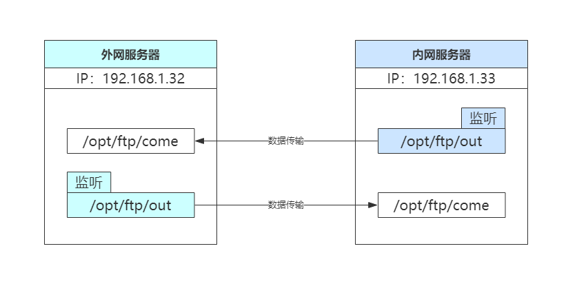

## PHP配合inotify实现光闸ftp功能
### 前言
>由于业务需要，内外网的数据需要进行实时交互同步，由于环境因素，只能通过`ftp`进行文件的交互传输。且没有硬件设备（光闸）；鉴于这种情况下，首先考虑到的是通过`shell`脚本进行自动上传下载文件。然而在实施部署过程中发现，通过`shell`脚本方式进行文件的上传下载每一个文件都会建立一次连接。（由于环境因素，ftp通过网闸再通过`vpn`建立一次连接巨慢，大概需要几十秒。）可是项目站点必须是实时进行文件的传输，且每次可能是多个文件，多者甚至上百个。经过探讨考虑到使用`rsync+inotify`，通过rsync的守护进程模式进行文件的传输。可是这种项目迟早得换成光闸走`ftp`进行文件的传输。而后又考虑直接在代码里面实现建立`ftp`的长连接进行文件传输（建立一次连接，然后一直处于监听模式，发现有文件就及时进行传送）,这样一来又考虑到目录的监听情况，开始准备使用`inotify-tools`进行监听然后调用`php`代码里面的`ftp`长连接进程，随后又在`php`官方发现`php`也有一个`inotify`可以用来进行目录的监听，然后触发动作。
>于是，最终方案就是在内外网两台服务器上面搭建`ftp`服务，然后通过`php`脚本进行目录的监听并上传到`ftp`服务器。

>具体实现流程说明
>1、内外网的服务器均安装`ftp`。
>2、内外网的服务器均安装`php`及`php`的`inotify`插件。
>3、内外网的服务器均安装`redis`。（`php`分为两个文件，一个为文件(`listen.php`)用于监听，一个文件(`upFile.php`)用于上传文件，由于开始没有存入`redis`，导致文件堆积，然后一直阻塞。故最终方案通过监听文件将监听到发生变化的文件路径存入到`redis`里，然后通过`upfile`脚本将文件上传到`ftp`）


### 环境说明
|      IP      |        主机名        | 系统版本  | 网络说明 |
| :----------: | :------------------: | :-------: | :------: |
| 192.168.1.32 | internet.example.com | CenTOS7.4 | 模拟外网 |
| 192.168.1.33 |   lan.example.com    | CenTOS7.4 | 模拟内网 |


>1、这里是通过两台虚拟机进行模拟内外网。且上面真实项目操作系统为`CenTOS6.5`；这里使用`CenTOS7.5`模拟。
>2、两台服务器需要安装软件有：`vsftpd`、`php`、`php`插件`inotify`
>3、外网的`/opt/ftp/out`目录只要有新的文件产生就会自动触发监听然后传送至内网的`/opt/ftp/come`目录。
>4、反之一样，内网的`/opt/ftp/out`目录只要有新的文件产生就会自动触发监听然后传送至外网的`/opt/ftp/come`目录。

### 项目结构图


## 具体实验步骤
### 安装配置vsftpd
>说明：内外网都需要配置`vsftpd`，配置`vsftpd`虚拟用户可参考 https://www.cnblogs.com/yanjieli/p/10723108.html

```
# mkdir -p /opt/ftp/{come,out}    #创建对应的数据目录
# yum -y install vsftpd    #安装vsftpd
# useradd -s /sbin/nologin apache    #由于项目站点所使用的apache用户，所以这里为了防止权限问题，这里也是用apache用户作为虚拟用户
# chown apache.apache /opt/ftp/ -R    #将数据目录权限改为apache用户
# cat >/etc/vsftpd/logins.txt<<-EOF    #创建ftp虚拟账号和密码，一行账号一行密码
ftp_come_user
Ftp_come_password@Qaz123
EOF

# db_load -T -t hash -f /etc/vsftpd/logins.txt /etc/vsftpd/login.db    #将密码文件转换成db格式
# chmod 600 /etc/vsftpd/login.db    #更改db文件的权限

# cat >/etc/pam.d/ftp<<-EOF    #定义pam认证文件
auth  required  /lib64/security/pam_userdb.so  db=/etc/vsftpd/login
account  required  /lib64/security/pam_userdb.so  db=/etc/vsftpd/login
EOF

# cp /etc/vsftpd/vsftpd.conf{,.back}    #备份配置文件
# vim /etc/vsftpd/vsftpd.conf    #编辑vsftpd主配置文件
anonymous_enable=NO
local_enable=YES
write_enable=NO
anon_upload_enable=NO
anon_mkdir_write_enable=NO
anon_other_write_enable=NO
chroot_local_user=YES
allow_writeable_chroot=YES
guest_enable=YES
guest_username=apache
listen=YES
listen_port=21
pasv_enable=YES
pasv_address=192.168.1.32    #内网的那台改成对应内网的IP地址
pasv_min_port=10000
pasv_max_port=10088
anon_world_readable_only=NO
user_config_dir=/etc/vsftpd/user_conf
tcp_wrappers=YES

# vim /etc/vsftpd/user_conf/ftp_come_user    #编辑虚拟用户的子配置文件
write_enable=YES
anon_world_readable_only=no
anon_upload_enable=YES
anon_mkdir_write_enable=YES
anon_other_write_enable=YES
anon_umask=022
local_root=/opt/ftp/come

# systemctl start vsftpd    #启动ftp
```

### 测试ftp
1）在外网（`192.168.1.32`）上访问内网（`192.168.1.33`）的`ftp`
```
[root@internet ~]# dd if=/dev/zero of=testfile bs=1M count=100    #创建一个测试文件用于测试上传
[root@internet ~]# lftp ftp_come_user:Ftp_come_password@Qaz123@192.168.1.33    #通过lftp工具连接ftp
lftp ftp_come_user@192.168.1.33:~> lcd
lcd 成功, 本地目录=/root
lftp ftp_come_user@192.168.1.33:~> put testfile
104857600 bytes transferred in 2 seconds (55.59M/s)
lftp ftp_come_user@192.168.1.33:/> ls
-rw-r--r--    1 1001     1001     104857600 Aug 05 12:41 testfile
```
2）在内网（`192.168.1.33`）上访问外网（`192.168.1.32`）的`ftp`
```
[root@lan ~]# dd if=/dev/zero of=testfile1 bs=1M count=100    #同样创建一个测试文件
[root@lan ~]# lftp ftp_come_user:Ftp_come_password@Qaz123@192.168.1.32
lftp ftp_come_user@192.168.1.32:~> put testfile1
104857600 bytes transferred in 3 seconds (31.87M/s)              
lftp ftp_come_user@192.168.1.32:/>
lftp ftp_come_user@192.168.1.32:/> ls
-rw-r--r--    1 1001     1001     104857600 Aug 05 12:45 testfile1
```
3）在内网的`/opt/ftp/come`目录验证是否存在`testfile`文件
```
[root@lan ~]# ll /opt/ftp/come/
总用量 102400
-rw-r--r-- 1 apache apache 104857600 8月   5 20:41 testfile
```
4）在外网的`/opt/ftp/come`目录验证是否存在`testfile1`文件
```
[root@internet ~]# ll /opt/ftp/come/
总用量 102400
-rw-r--r-- 1 apache apache 104857600 8月   5 20:45 testfile1
```
通过测试`ftp`已经`ok`


### 安装配置redis
> 生产环境`redis`可能端口不一样，然后根据不同的进行配置即可。同时设置连接密码，（这里只是测试，所以两边的配置一样）

```
# yum -y install redis    #安装redis
# cp /etc/redis.conf{,.back}    #拷贝redis配置文件
# vim /etc/redis.conf    #编辑redis配置文件
daemonize yes    #开启后台常驻进程
requirepass obohna7Fogai9ahnahth    #设置redis连接密码
# systemctl start redis    #启动redis
# netstat -nlutp |grep 6379    #检查端口是否打开
tcp        0      0 127.0.0.1:6379          0.0.0.0:*               LISTEN      7139/redis-server 1
```

### 安装php及inotify插件
1）`yum`安装`php`
```
# wget -O /etc/yum.repos.d/epel.repo http://mirrors.aliyun.com/repo/epel-7.repo
# rpm -Uvh http://rpms.famillecollet.com/enterprise/remi-release-7.rpm
# yum install --enablerepo=remi,remi-php56 php php-opcache php-pecl-apcu php-devel php-mbstring php-mcrypt php-mysqlnd php-phpunit-PHPUnit php-pecl-xdebug php-pecl-xhprof php-pdo php-pear php-fpm php-cli php-xml php-bcmath php-process php-gd php-common php-memcache php-redis php-pspell  php-fpm  php-mysql php-common php-mssql
```
2）安装`php`插件`inotify`
```
# wget http://pecl.php.net/get/inotify-0.1.6.tgz    #下载软件包
# tar xf inotify-0.1.6.tgz    #解压软件包
# yum install gcc gcc-c++ make    #安装编译工具
# tar xf inotify-0.1.6.tgz
# cd inotify-0.1.6/
# phpize
# ./configure --with-php-config=/usr/bin/php-config --enable-inotify
# make && make install
# echo "extension = inotify.so" >> /etc/php.d/inotify.ini
# php -i|grep inotify
# systemctl start php-fpm
```

### 编写PHP脚本
>内外网其实一样，只是配置的连接信息不一样。

1）监听脚本(`listen.php`)
```
[root@internet ~]# mkdir /home/script
[root@internet ~]# vim /home/script/listen.php
<?php
/**
 * Created by PhpStorm.
 * User: ADMIN
 * Date: 2019/7/31
 * Time: 19:21
 */

define('REDIS_HOST','127.0.0.1'); //redis连接主机
define('REDIS_PASSWORD','obohna7Fogai9ahnahth');  //redis连接密码
define('REDIS_PORT','6379');  //redis端口

define('__LISTEN_DIR__',"/opt/ftp/out");  //本地监听目录


class Monitor{

    private $dir = '';

    //文件新增事件回调
    private $onfileAdd;

    public $timeout = 1;

    public function __construct($dir,$onfileAdd)
    {
        if (!extension_loaded('inotify')) {
            echo '请安装inotify扩展', PHP_EOL;
            exit;
        }

        $this->dir = $dir;

        $this->onfileAdd = $onfileAdd;

        $this->run();
    }

    //对目录进行监控
    public function run()
    {
        $dirs = $this->getDirs($this->dir);
        if (empty($dirs)) {
            return false;
        }
        $fd = inotify_init();
        //设置为非阻塞模式
        stream_set_blocking($fd, 0);
        $watcher = [];
        foreach ($dirs as $dir) {
            $watch = inotify_add_watch($fd, $dir, IN_MODIFY | IN_CREATE | IN_DELETE | IN_DELETE_SELF | IN_CLOSE_WRITE);
            if (!$watch) {
                echo "{$dir} 添加监控错误", PHP_EOL;
                exit;
            }
            $watcher[$watch] = $dir;
        }
        while (true) {
            $reads = [$fd];
            $write = [];
            $except = [];
            if (stream_select($reads, $write, $except, $this->timeout) > 0) {
                if (!empty($reads)) {
                    foreach ($reads as $read) {
                        //从可读流中读取数据
                        $events = inotify_read($read);
                        $fileName = '';
                        foreach ($events as $event) {

                            //文件改变
                            $fileChg = false;
                            //目录改变
                            $dirChg = false;

                            $fileName = $event['name'];
                            switch ($event['mask']) {
                                case IN_CREATE:     //创建   IN_CLOSE_WRITE  写入结束
                                case IN_DELETE:
                                    $fileChg = true;
                                    break;
                                case 1073742080:
                                case 1073742336:
                                    $dirChg = true;
                                    break;
                            }

                            if ($fileChg) {
                                $filepath = $watcher[$event['wd']] . '/' . $fileName;
                                if($watcher[$event['wd']] == $this->dir){
                                    $newfile = $fileName;
                                }else{
                                    $newfile = str_replace($this->dir,'.',$filepath);
                                }

                                echo date('Y-m-d H:i:s') . " | 事件目录：" . $filepath .  "，事件出现：{$event['mask']} ，文件/目录 {$fileName} 发生改变" . PHP_EOL;
                                echo date('Y-m-d H:i:s') . " | " . $newfile . PHP_EOL;
//                                echo "文件 {$fileName} 发生改变", PHP_EOL;
//                            echo shell_exec($this->cmd), PHP_EOL;
//                                SysutilLogger::instance()->fileAdd("事件目录：" . $watcher[$event['wd']] . "，事件出现：{$event['mask']} ，文件/目录 {$fileName} 发生改变");
                                call_user_func_array($this->onfileAdd,[$filepath,$newfile]);

                            }
                            if ($dirChg) {
//                                echo "目录 {$fileName} 发生改变", PHP_EOL;
//                            echo shell_exec($this->cmd), PHP_EOL;
                                //目录发生改变时  重新监听
                                return $this->run();
                            }
                        }

                    }
                }
            }
        }
        return true;
    }

    //递归的获取当前目录下所有子目录路径
    public function getDirs($dir)
    {
        $dir = realpath($dir);
        $dh = opendir($dir);
        if (!$dh) {
            return [];
        }
        $dirs = [];
        $dirs[] = $dir;
        while (($file = readdir($dh)) !== false) {
            if ($file == '.' || $file == '..') {
                continue;
            }
            $full = $dir . DIRECTORY_SEPARATOR . $file;
            if (is_dir($full)) {
                $dirs = array_merge($dirs, $this->getDirs($full));
            }
        }
        closedir($dh);
        return $dirs;
    }

}

class SysutilRedis {

    private static $_instance;
    private $m_redis = null;
    private $mid_redis = null;      //律师中心redis实例

    /**
     * @return SysutilRedis|Redis
     */
    public static function instance()
    {
        if ( ! isset(SysutilRedis::$_instance))
        {
            SysutilRedis::$_instance = new SysutilRedis();
        }
        return SysutilRedis::$_instance;
    }

    /**
     * @return null|Redis
     */
    public function getRedis()
    {
        if( !$this->m_redis ){
            $this->m_redis = new Redis();
            $this->m_redis->connect(REDIS_HOST,REDIS_PORT,10); //php客户端设置的ip及端口
            $this->m_redis->auth(REDIS_PASSWORD);
        }
        return $this->m_redis;
    }


    public function close_redis()
    {
        if($this->m_redis) {
            $this->m_redis->close();
            $this->m_redis = null;
        }
        if($this->mid_redis) {
            $this->mid_redis->close();
            $this->mid_redis = null;
        }
    }

    public function __destruct()
    {
        $this->close_redis();
    }


}


class Listenner {


    public function run(){

        $callBack = [$this,"toRedis"];

        $listen_dir = __LISTEN_DIR__;

        $monitor = new Monitor($listen_dir,$callBack);

        $monitor->run();

    }

    /**
     * @describe 文件回调
     * @author zhouyong
     */
    public function toRedis($filename,$newfile){

        $redis = SysutilRedis::instance()->getRedis();
        $redis->select(9);
        $cache_id = 'upload_file_list';
        $data = [
            'local' => $filename,
            'remote' => $newfile
        ];
        $redis->rpush($cache_id, json_encode($data));
    }


}

$listenner = new Listenner();

$listenner->run();
```
2）上传文件脚本(`upFile.php`)
```
[root@internet ~]# vim /home/script/upFile.php
<?php
/**
 * Created by PhpStorm.
 * User: ADMIN
 * Date: 2019/7/31
 * Time: 19:21
 */

define('REDIS_HOST','127.0.0.1'); //redis连接主机
define('REDIS_PASSWORD','obohna7Fogai9ahnahth');  //redis连接密码
define('REDIS_PORT','6379');  //redis端口


define('FTP_HOST','192.168.1.33');  //内网ftp服务器
define('FTP_PORT',21); //ftp端口
define('FTP_USER','ftp_come_user');  //ftp连接账号
define('FTP_PASS','Ftp_come_password@Qaz123');  //ftp连接密码

class SysutilFtp
{

    private static $instance;


    public $off; // 返回操作状态(成功/失败)

    public $conn_id; // FTP连接
    /**
     * 方法：FTP连接
     * @FTP_HOST -- FTP主机
     * @FTP_PORT -- 端口
     * @FTP_USER -- 用户名
     * @FTP_PASS -- 密码
     */
    private function __construct($FTP_HOST,$FTP_PORT,$FTP_USER,$FTP_PASS)
    {
        $this->conn_id = @ftp_connect($FTP_HOST,$FTP_PORT) or die("FTP服务器连接失败");
        @ftp_login($this->conn_id,$FTP_USER,$FTP_PASS) or die("FTP服务器登陆失败");
        @ftp_pasv($this->conn_id,1); // 打开被动模拟
    }

    /**
     * @describe 获取ftp实例
     */
    public static function getInstance(){
        if(!self::$instance){
            self::$instance = new self(FTP_HOST,FTP_PORT,FTP_USER,FTP_PASS);
            if(self::$instance){
                echo date('Y-m-d H:i:s') . " | connected !" . PHP_EOL;
            }
        }
        return self::$instance;
    }

    /**
     * @describe 重连
     * @author zhouyong
     */
    private function reConnect(){
        echo date('Y-m-d H:i:s') . " | closing connection ......" . PHP_EOL;
        //关闭当前链接
        $this->close();
        echo date('Y-m-d H:i:s') . " | reconnecting...." . PHP_EOL;
        //开辟新连接
        self::$instance = new self(FTP_HOST,FTP_PORT,FTP_USER,FTP_PASS);

        echo date('Y-m-d H:i:s') . " | connected !" . PHP_EOL;
    }
    /**
     * 方法：上传文件
     * @path -- 本地路径
     * @newpath -- 上传路径
     * @type -- 若目标目录不存在则新建
     * @return true
     */
    function up_file($path,$newpath,$type=true)
    {
        if($type) $this->dir_mkdirs($newpath);
        echo date('Y-m-d H:i:s') . " | 当前目录" . ftp_pwd($this->conn_id) . PHP_EOL;
        $newpath = ltrim($newpath,'.');
        echo $newpath . PHP_EOL;
        $this->off = @ftp_put($this->conn_id,$newpath,$path,FTP_BINARY);
        if(!$this->off){
//            echo "文件上传失败，请检查权限及路径是否正确！";
//            echo "文件上传失败，正在发起重连.....";
//            $this->reConnect();
//            echo date('Y-m-d H:i:s') . " | re-uploading file {$path} to {$newpath} ...." . PHP_EOL;
//            $this->up_file($path,$newpath,$type=true);
            echo date('Y-m-d H:i:s') . " | 上传失败" . PHP_EOL;
//            exit;
            return false;
        } else {
            echo date('Y-m-d H:i:s') . " | upload success !" . PHP_EOL;
            return true;
        }
    }
    /**
     * 方法：移动文件
     * @path -- 原路径
     * @newpath -- 新路径
     * @type -- 若目标目录不存在则新建
     */
    function move_file($path,$newpath,$type=true)
    {
        if($type) $this->dir_mkdirs($newpath);
        $this->off = @ftp_rename($this->conn_id,$path,$newpath);
        if(!$this->off) echo "文件移动失败，请检查权限及原路径是否正确！";
    }
    /**
     * 方法：复制文件
     * 说明：由于FTP无复制命令,本方法变通操作为：下载后再上传到新的路径
     * @path -- 原路径
     * @newpath -- 新路径
     * @type -- 若目标目录不存在则新建
     */
    function copy_file($path,$newpath,$type=true)
    {
        $downpath = "c:/tmp.dat";
        $this->off = @ftp_get($this->conn_id,$downpath,$path,FTP_BINARY);// 下载
        if(!$this->off) echo "文件复制失败，请检查权限及原路径是否正确！";
        $this->up_file($downpath,$newpath,$type);
    }
    /**
     * 方法：删除文件
     * @path -- 路径
     */
    function del_file($path)
    {
        $this->off = @ftp_delete($this->conn_id,$path);
        if(!$this->off) echo "文件删除失败，请检查权限及路径是否正确！";
    }
    /**
     * 方法：生成目录
     * @path -- 路径
     */
    function dir_mkdirs($path)
    {
        $path_arr = explode('/',$path); // 取目录数组
        $file_name = array_pop($path_arr); // 弹出文件名
        $path_div = count($path_arr); // 取层数
        print_r($path_arr);
        foreach($path_arr as $val) // 创建目录
        {
            if(@ftp_chdir($this->conn_id,$val) == FALSE)
            {
                $tmp = @ftp_mkdir($this->conn_id,$val);
                echo date('Y-m-d H:i:s') . " | 创建目录{$val}" . PHP_EOL;
                if($tmp == FALSE)
                {
                    echo date('Y-m-d H:i:s') . " | 目录创建失败，请检查权限及路径是否正确！" . PHP_EOL;
                    exit;
                }
                @ftp_chdir($this->conn_id,$val);
            }
        }
        echo date('Y-m-d H:i:s') . " | 创建目录成功" . PHP_EOL;

        echo date('Y-m-d H:i:s') . " | 当前目录" . ftp_pwd($this->conn_id) . PHP_EOL;
        for($i=1;$i<$path_div;$i++) // 回退到根
        {
            @ftp_cdup($this->conn_id);
            echo date('Y-m-d H:i:s') . " | 当前目录" . ftp_pwd($this->conn_id) . PHP_EOL;
        }
    }

    function ping(){
        echo date("Y-m-d H:i:s") . " |  发送心跳数据 " . PHP_EOL;
        @ftp_raw($this->conn_id,'pingpong');
    }
    /**
     * 方法：关闭FTP连接
     */
    function close()
    {
        @ftp_close($this->conn_id);
    }
}// class class_ftp end


class SysutilRedis {

    private static $_instance;
    private $m_redis = null;
    private $mid_redis = null;      //律师中心redis实例

    /**
     * @return SysutilRedis
     */
    public static function instance(){
        if ( ! isset(SysutilRedis::$_instance))
        {
            SysutilRedis::$_instance = new SysutilRedis();
        }
        return SysutilRedis::$_instance;
    }

    /**
     * @return null|Redis
     */
    public function getRedis()
    {
        if( !$this->m_redis ){
            $this->m_redis = new Redis();
            $this->m_redis->connect(REDIS_HOST,REDIS_PORT,10); //php客户端设置的ip及端口
            $this->m_redis->auth(REDIS_PASSWORD);
        }
        return $this->m_redis;
    }


    public function close_redis()
    {
        if($this->m_redis) {
            $this->m_redis->close();
            $this->m_redis = null;
        }
        if($this->mid_redis) {
            $this->mid_redis->close();
            $this->mid_redis = null;
        }
    }

    public function __destruct()
    {
        $this->close_redis();
    }


}

$redis = SysutilRedis::instance()->getRedis();
$redis->select(9);
$cache_id = 'upload_file_list';

$no_data_time = 0;
$ping = 3;      //心跳时间   每 x 秒发送一次心跳数据
while (true){

    $data = $redis->lRange($cache_id, 0, -1);
    if (!empty($data)) {
        $no_data_time = 0;
        foreach ($data as $key => $value) {
            $v = json_decode($value, true);
            $result = up_file($v['local'],$v['remote']);
            if($result){
                $redis->select(9);
                $redis->lPop($cache_id);
            }else{
                echo date("Y-m-d H:i:s") . "| 退出脚本";
                exit();
            }

        }
    }else{
        if($no_data_time > 0){
            //查看没有事件的时间
            $time = time();
            if(($time - $no_data_time) > $ping){
                //发送心跳  并重置时间
                ping_ftp();
                $no_data_time = $time;
            }
        }else{
            $no_data_time = time();
        }
    }

}

function up_file($filename,$newfile){
    echo date('Y-m-d H:i:s') . " | $filename ,  $newfile" . PHP_EOL;
    $ftp = SysutilFtp::getInstance();
    return $ftp->up_file($filename,$newfile);
}

function ping_ftp(){
    $ftp = SysutilFtp::getInstance();
    $ftp->ping();
}
```
3）启动脚本并测试
```
#在一个终端启动listen.php脚本
[root@internet ~]# php -f /home/script/listen.php


#在另外一个终端启动upFile.php脚本
[root@internet ~]# php -f /home/script/upFile.php 
2019-08-06 11:24:11 | connected !
2019-08-06 11:24:11 |  发送心跳数据


#在第三个终端往监听目录/opt/ftp/out目录新建一个文件或目录进行测试
[root@internet ~]# echo "test" >> /opt/ftp/out/file1

#分别可以在上面第一个终端和第二个终端看到日志信息
终端一的信息：
2019-08-06 11:36:26 | 事件目录：/opt/ftp/out/file1，事件出现：256 ，文件/目录 file1 发生改变
2019-08-06 11:36:26 | file1

终端二的信息：
2019-08-06 11:36:26 | /opt/ftp/out/file1 ,  file1
Array
(
)
2019-08-06 11:36:26 | 创建目录成功
2019-08-06 11:36:26 | 当前目录/
2019-08-06 11:36:26 | 当前目录/
file1
2019-08-06 11:36:26 | upload success !
```


### 管理两个脚本
1）编写监控脚本，当进程挂掉便重启
```
# vim /home/script/process_alive.sh
#!/bin/bash
#用来监听listen脚本和upFile脚本

DATE=[`date "+%Y-%m-%d %H:%M:%S"`]

function phpScriptAlive {
    script_dir=/home/script/
    ps aux |grep -v grep |grep $1 >> /dev/null
    if [[ $? != 0 ]]; then
        nohup php -f ${script_dir}/$1 >> /var/log/$2 &
        echo "${DATE} 重启php脚本 $1" >> /var/log/php_script_restart.log
    fi
}

phpScriptAlive listen.php php_listen.log
phpScriptAlive upFile.php php_upfile.log
```

2）添加到计划任务
```
# chmod +x /home/script/process_alive.sh 
# 监听php脚本进程
* * * * * /bin/bash /home/script/process_alive.sh
```
3）查看日志；由于上面脚本里面写了将所有输出都记录到日志里面，所以后续直接查看日志即可
```
[root@internet ~]# tailf /var/log/php
php-fpm/                php_listen.log          php_script_restart.log  php_upfile.log
[root@internet ~]# tailf /var/log/php_listen.log 
^C
[root@internet ~]# tailf /var/log/php_upfile.log 
2019-08-06 12:01:18 |  发送心跳数据 
2019-08-06 12:01:22 |  发送心跳数据 
2019-08-06 12:01:26 |  发送心跳数据 
2019-08-06 12:01:30 |  发送心跳数据 
```
4）再次往`/opt/ftp/out/`目录丢文件，便会自动同步到内网或者外网的`/opt/ftp/come`目录。
```
[root@internet ~]# echo "sjdklf" >> /opt/ftp/out/file111
[root@internet ~]# for i in `seq 10`; do echo "sjdlfjskldjf" >> /opt/ftp/out/txt$i ; don

#内网查看
[root@lan ~]# ll /opt/ftp/come/
总用量 48
-rw-r--r-- 1 apache apache  5 8月   6 11:36 file1
-rw-r--r-- 1 apache apache  7 8月   6 12:06 file111
-rw-r--r-- 1 apache apache 13 8月   6 12:07 txt1
-rw-r--r-- 1 apache apache 13 8月   6 12:07 txt10
-rw-r--r-- 1 apache apache 13 8月   6 12:07 txt2
-rw-r--r-- 1 apache apache 13 8月   6 12:07 txt3
-rw-r--r-- 1 apache apache 13 8月   6 12:07 txt4
-rw-r--r-- 1 apache apache 13 8月   6 12:07 txt5
-rw-r--r-- 1 apache apache 13 8月   6 12:07 txt6
-rw-r--r-- 1 apache apache 13 8月   6 12:07 txt7
-rw-r--r-- 1 apache apache 13 8月   6 12:07 txt8
-rw-r--r-- 1 apache apache 13 8月   6 12:07 txt9
```


