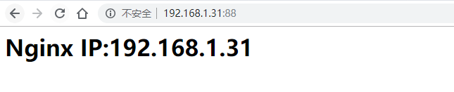

## 说明
>通过`Nginx`解析静态页面并将动态负载均衡调度给后面的多个`Tomcat`，`Tomcat`解析`java`动态程序。

>由于http是无状态的协议，你访问了页面A，然后在访问B，http无法确定这2个访问来自一个人
>，因此要用cookie或session来跟踪用户，根据授权和用户身份来显示不同的页面。
>比如用户A登陆了，那么能看到自己的个人信息，而B没登陆，无法看到个人信息。
>还有A可能在购物，把商品放入购物车，此时B也有这个过程，你无法确定A，B的身份和购物信息，所以需要一个session ID来维持这个过程。所以就用到了session管理。

[官网文档](https://github.com/magro/memcached-session-manager/wiki/SetupAndConfiguration)

## 环境规划
| 主机         | hostname              | 环境                 |      |
| ------------ | --------------------- | -------------------- | ---- |
| 192.168.1.31 | nginx.cluster.com     | nginx（yum安装）     |      |
| 192.168.1.32 | tomcat1.cluster.com   | tomcat-9.0           |      |
| 192.168.1.33 | tomcat2.cluster.com   | tomcat-9.0           |      |
| 192.168.1.34 | memcached.cluster.com | memcached（yum安装） |      |

>关闭防火墙，selinux；时间同步；host绑定等基本配置 (步骤略)

## 具体步骤
本案例所使用的`tomcat`、`jdk`、和`tomcat-session`相关的jar包下载地址
链接：https://pan.baidu.com/s/1ESm_RSrFx77kWObmCt1DQw 
提取码：f64n 

### memcached部署
>说明：memcached这里不需要配置太多，安装即可，然后检查端口是否处于监听中。tomcat服务器能成功连接即可
```
[root@memcached ~]# yum -y install memcached
[root@memcached ~]# systemctl enable memcached
[root@memcached ~]# systemctl start memcached

[root@memcached ~]# lsof -i:11211
COMMAND    PID      USER   FD   TYPE DEVICE SIZE/OFF NODE NAME
memcached 4419 memcached   26u  IPv4  51021      0t0  TCP *:memcache (LISTEN)
memcached 4419 memcached   27u  IPv6  51022      0t0  TCP *:memcache (LISTEN)
memcached 4419 memcached   28u  IPv4  51025      0t0  UDP *:memcache 
memcached 4419 memcached   29u  IPv6  51026      0t0  UDP *:memcache
```

### nginx部署
1）安装nginx
```
[root@nginx ~]# yum -y install nginx
[root@nginx ~]# nginx -v
nginx version: nginx/1.12.2
```
2）配置文件配置
```
# 创建一个虚拟主机
[root@nginx ~]# vim /etc/nginx/conf.d/www.conf
upstream tomcat {
    server 192.168.1.32:8080 weight=1;
    server 192.168.1.33:8080 weight=1;
}

server {
    listen       88 default_server;
    server_name  localhost;
    root         /opt/project;

#已jsp结尾的动态程序调度给tomcat去处理
    location ~.*\.jsp$ {
        proxy_pass http://tomcat;
        proxy_set_header Host $host;
        proxy_set_header X-Forwarded-For $remote_addr;
    }

    error_page 404 /404.html;
        location = /40x.html {
    }

    error_page 500 502 503 504 /50x.html;
        location = /50x.html {
    }
}


# 创建测试文件
[root@nginx ~]# mkdir /opt/project
[root@nginx ~]# echo "<h1>Nginx IP:192.168.1.31</h1>" >> /opt/project/index.html
```

### tomcat部署
详细安装参考：https://www.cnblogs.com/yanjieli/p/11092350.html
**两台tomcat服务器都要执行下面的所有操作，也可以在一台上面执行，然后copy过去。**
1）上传软件包到服务器，编写一个临时使用的安装脚本
```
[root@tomcat1 ~]# cat install_tomcat.sh 
#!/bin/bash

#----安装java环境
function InstallJava (){
    tar xf jdk-8u211-linux-x64.tar.gz -C /usr/local/
    ln -s /usr/local/jdk1.8.0_211 /usr/local/java
    sed -i.ori '$a export JAVA_HOME=/usr/local/java \nexport PATH=$JAVA_HOME/bin:$JAVA_HOME/jre/bin:$PATH \nexport CLASSPATH=.$CLASSPATH:$JAVA_HOME/lib:$JAVA_HOME/jre/lib:$JAVA_HOME/lib/tools.jar' /etc/profile
    source /etc/profile
    java -version
}

#----安装tomcat环境
function InstallTomcat (){
    tar xf apache-tomcat-9.0.21.tar.gz -C /usr/local/
    ln -s /usr/local/apache-tomcat-9.0.21 /usr/local/tomcat
    echo "export TOMCAT_HOME=/usr/local/tomcat" >> /etc/profile
    source /etc/profile
}
InstallJava
InstallTomcat

/usr/local/tomcat/bin/startup.sh
```
2）执行脚本
```
[root@tomcat1 ~]# bash install_tomcat.sh 
java version "1.8.0_211"
Java(TM) SE Runtime Environment (build 1.8.0_211-b12)
Java HotSpot(TM) 64-Bit Server VM (build 25.211-b12, mixed mode)
Using CATALINA_BASE:   /usr/local/tomcat
Using CATALINA_HOME:   /usr/local/tomcat
Using CATALINA_TMPDIR: /usr/local/tomcat/temp
Using JRE_HOME:        /usr/local/java
Using CLASSPATH:       /usr/local/tomcat/bin/bootstrap.jar:/usr/local/tomcat/bin/tomcat-juli.jar
Tomcat started.

[root@tomcat1 ~]# ss -nltp |grep :80
LISTEN     0      100         :::8080                    :::*                   users:(("java",pid=2993,fd=54))
LISTEN     0      1         ::ffff:127.0.0.1:8005                    :::*                   users:(("java",pid=2993,fd=74))
LISTEN     0      100         :::8009                    :::*                   users:(("java",pid=2993,fd=59))
```
3）下载`memcached-session-manager`等相关软件包并`copy`到`tomcat`安装目录的`lib`目录中
```
[root@tomcat1 ~]# mkdir tools && cd tools

[root@tomcat1 ~]# wget http://repo1.maven.org/maven2/de/javakaffee/msm/memcached-session-manager/2.3.0/memcached-session-manager-2.3.0.jar
[root@tomcat1 ~]# wget http://repo1.maven.org/maven2/de/javakaffee/msm/memcached-session-manager-tc9/2.3.0/memcached-session-manager-tc9-2.3.0.jar
[root@tomcat1 ~]# wget http://repo1.maven.org/maven2/de/javakaffee/msm/msm-kryo-serializer/2.3.0/msm-kryo-serializer-2.3.0.jar
[root@tomcat1 ~]# wget http://repo1.maven.org/maven2/net/spy/spymemcached/2.12.2/spymemcached-2.12.2.jar
[root@tomcat1 ~]# wget https://repo1.maven.org/maven2/de/javakaffee/kryo-serializers/0.42/kryo-serializers-0.42.jar
[root@tomcat1 ~]# wget https://repo1.maven.org/maven2/com/esotericsoftware/reflectasm/1.11.0/reflectasm-1.11.0.jar
[root@tomcat1 ~]# wget https://repo1.maven.org/maven2/com/esotericsoftware/minlog/1.3.0/minlog-1.3.0.jar
[root@tomcat1 ~]# wget https://repo1.maven.org/maven2/com/esotericsoftware/kryo/4.0.0/kryo-4.0.0.jar
[root@tomcat1 ~]# wget https://repo1.maven.org/maven2/org/ow2/asm/asm/7.0/asm-7.0.jar
[root@tomcat1 ~]# wget http://repo1.maven.org/maven2/org/objenesis/objenesis/3.0.1/objenesis-3.0.1.jar

[root@tomcat1 tools]# cp ./* /usr/local/tomcat/lib/
```
4）编辑配置文件，添加连接`memcached`
```
# No-Stick模式
[root@tomcat1 ~]# vim /usr/local/tomcat/conf/context.xml
# 在<Context>和</Context>里面加上下面一段
<!-- 这里的ip为memcached服务器的IP,如果有多个memcached服务器，用逗号隔开 -->
    <Manager className="de.javakaffee.web.msm.MemcachedBackupSessionManager"
        memcachedNodes="n1:192.168.1.34:11211" 
        lockingMode="auto"
        sticky="false"
        requestUriIgnorePattern= ".*\.(png|gif|jpg|css|js)$"  
        sessionBackupAsync= "false"  
        sessionBackupTimeout= "100"  
        copyCollectionsForSerialization="true"  
        transcoderFactoryClass="de.javakaffee.web.msm.serializer.kryo.KryoTranscoderFactory" />
```
5）准备测试文件
```
[root@tomcat1 ~]# rm -rf /usr/local/tomcat/webapps/*
[root@tomcat1 ~]# mkdir /usr/local/tomcat/webapps/ROOT
[root@tomcat1 ~]# vim /usr/local/tomcat/webapps/ROOT/index.jsp
SessionID:<%=session.getId()%> <BR>
SessionIP:<%=request.getServerName()%> <BR>
SessionPort:<%=request.getServerPort()%>
```
6）重启`tomcat`
```
[root@tomcat1 ~]# /usr/local/tomcat/bin/shutdown.sh
[root@tomcat1 ~]# /usr/local/tomcat/bin/startup.sh
[root@tomcat1 ~]# lsof -i:8080
COMMAND  PID USER   FD   TYPE DEVICE SIZE/OFF NODE NAME
java    4672 root   63u  IPv6  52084      0t0  TCP *:webcache (LISTEN)
```
7）测试
访问tomcat1：

访问tomcat2：

访问nginx默认页面：

访问jsp动态程序：

通过上面的访问可以看出，访问静态页面时nginx自身处理，当访问jsp动态的时候会调度给tomcat去处理。并且当一个浏览器访问后，便会一直访问这一个，so，这样就达到了session会话保持。

----
**补充**
memcached-session-manager 参数说明：
```
memcachedNodes 必选项，memcached的节点信息，多个memcached节点,中间需要使用空格

failoverNodes="n2"  表示当前session保持到n1的memcached节点上
failoverNodes  可选项，不能使用在non-sticky sessions模式。故障转移配置节点，多个使用空格或逗号分开，配置某个节点为备份节点，
当其他节点都不可用时才会存储到备份节点，官方建议配置为和tomcat同服务器的节点。
理由如下:
假如有两台服务器m1,m2，其中m1部署tomcat和memcached节点n1，m2部署memcached节点n2。
如果配置tomcat的failoverNodes值为n2或者不配置，则当服务器m1挂掉后n1和tomcat中保存的session会丢失，而n2中未保存或者只保存了部分session，
这就造成 部分用户状态丢失。
如果配置tomcat的failoverNodes值为n1，则当m1挂掉后因为n2中保存了所有的session，所以重启tomcat的时候用户状态不会丢失。
为什么n2中保存了所有的session? 因为failoverNodes配置的值是n1，只有当n2节点不可用时才会把session存储到n1，所以这个时候n1中是没有保存任何session的。
lockingMode  可选值，默认none，只对non-sticky有效。
requestUriIgnorePattern  可选值，制定忽略那些请求的session操作，一般制定静态资源如css,js一类的。
sessionBackupAsync    可选值，默认true，是否异步的方式存储到memcached。
sessionBackupTimeout  可选项，默认100毫秒，异步存储session的超时时间。
```

相关软件包jar包下载：
```
memcached-session-manager 下载地址：http://repo1.maven.org/maven2/de/javakaffee/msm/
http://repo1.maven.org/maven2/de/javakaffee/msm/memcached-session-manager/2.3.0/memcached-session-manager-2.3.0.jar
http://repo1.maven.org/maven2/de/javakaffee/msm/memcached-session-manager-tc9/2.3.0/memcached-session-manager-tc9-2.3.0.jar

msm-kryo-serializer    下载地址：http://repo1.maven.org/maven2/de/javakaffee/msm/msm-kryo-serializer/
http://repo1.maven.org/maven2/de/javakaffee/msm/msm-kryo-serializer/2.3.0/msm-kryo-serializer-2.3.0.jar

spymemcached    下载地址：http://repo1.maven.org/maven2/net/spy/spymemcached/
http://repo1.maven.org/maven2/net/spy/spymemcached/2.12.2/spymemcached-2.12.2.jar

serializers    下载地址：https://repo1.maven.org/maven2/de/javakaffee/kryo-serializers/
https://repo1.maven.org/maven2/de/javakaffee/kryo-serializers/0.42/kryo-serializers-0.42.jar

reflectasm    下载地址：https://repo1.maven.org/maven2/com/esotericsoftware/reflectasm
https://repo1.maven.org/maven2/com/esotericsoftware/reflectasm/1.11.0/reflectasm-1.11.0.jar

minlog    下载地址：https://repo1.maven.org/maven2/com/esotericsoftware/minlog
https://repo1.maven.org/maven2/com/esotericsoftware/minlog/1.3.0/minlog-1.3.0.jar

kryo    下载地址：https://repo1.maven.org/maven2/com/esotericsoftware/kryo
https://repo1.maven.org/maven2/com/esotericsoftware/kryo/4.0.0/kryo-4.0.0.jar

asm    下载地址：https://repo1.maven.org/maven2/org/ow2/asm/asm/
https://repo1.maven.org/maven2/org/ow2/asm/asm/7.0/asm-7.0.jar     

objenesis    下载地址：http://repo1.maven.org/maven2/org/objenesis/objenesis/
http://repo1.maven.org/maven2/org/objenesis/objenesis/3.0.1/objenesis-3.0.1.jar
```

