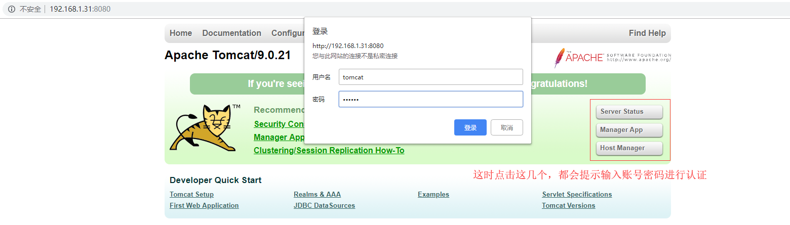

## Tomcat简介
官网：http://tomcat.apache.org/
>`Tomcat`服务器是一个免费的开源代码的Web应用服务器，属于轻量级应用服务器，在中小型系统和并发访问用户不是很多的场合下使用，是开发和调试`JSP`程序的首选。
>`Tomcat`和`Nginx`、`Apache`等`Web`服务器一样，具有处理`HTML`页面的功能，另外它还是一个`Servlet`和`JSP`容器，独立的`Servlet`容器是`Tomcat`的默认模式。不过，`Tomcat`处理静态`HTML`的能力不如`Nginx/Apache`服务器。
>一般情况下多用`Nginx+Tomcat`，`Nginx`处理静态，`Tomcat`处理动态程序

## Tomcat安装
>软件下载：[JDK下载](https://www.oracle.com/technetwork/java/javase/downloads/jdk8-downloads-2133151.html)  &emsp; [Tomcat下载](http://tomcat.apache.org/)
>本文使用的软件包`jdk-8u211`,`tomcat-9.0.21`。 [下载链接](https://pan.baidu.com/s/1d0g0T75p-CW7uz3ug7I8YA) &emsp; 提取码：f0ay

### 部署Java环境
将下载的软件包上传到服务器
```
# 解压软件包
[root@tomcat ~]# tar xf jdk-8u211-linux-x64.tar.gz -C /usr/local/

# 创建一个软链接
[root@tomcat ~]# ln -s /usr/local/jdk1.8.0_211 /usr/local/java

# 添加环境变量
[root@tomcat ~]# sed -i.ori '$a export JAVA_HOME=/usr/local/java \nexport PATH=$JAVA_HOME/bin:$JAVA_HOME/jre/bin:$PATH \nexport CLASSPATH=.$CLASSPATH:$JAVA_HOME/lib:$JAVA_HOME/jre/lib:$JAVA_HOME/lib/tools.jar' /etc/profile

# 重新加载环境变量
[root@tomcat ~]# source /etc/profile
[root@tomcat ~]# env |grep JAVA
JAVA_HOME=/usr/local/java

# 查看是否安装成功
[root@tomcat ~]# java -version
java version "1.8.0_211"
Java(TM) SE Runtime Environment (build 1.8.0_211-b12)
Java HotSpot(TM) 64-Bit Server VM (build 25.211-b12, mixed mode)
```

### 部署Tomcat
```
# 解压软件包
[root@tomcat ~]# tar xf apache-tomcat-9.0.21.tar.gz -C /usr/local/

# 创建一个软链接
[root@tomcat ~]# ln -s /usr/local/apache-tomcat-9.0.21 /usr/local/tomcat

# 定义tomcat所需的环境变量
[root@tomcat ~]# echo "export TOMCAT_HOME=/usr/local/tomcat" >> /etc/profile

# 重新加载环境变量
[root@tomcat ~]# source /etc/profile
```

## Tomcat启动
1）默认的启动方式
```
[root@tomcat ~]# ls /usr/local/tomcat/bin/startup.sh   #启动脚本
/usr/local/tomcat/bin/startup.sh
[root@tomcat ~]# ls /usr/local/tomcat/bin/shutdown.sh   #停止脚本
/usr/local/tomcat/bin/shutdown.sh

# 默认方式启动
[root@tomcat ~]# /usr/local/tomcat/bin/startup.sh 
Using CATALINA_BASE:   /usr/local/tomcat
Using CATALINA_HOME:   /usr/local/tomcat
Using CATALINA_TMPDIR: /usr/local/tomcat/temp
Using JRE_HOME:        /usr/local/java
Using CLASSPATH:       /usr/local/tomcat/bin/bootstrap.jar:/usr/local/tomcat/bin/tomcat-juli.jar
Tomcat started.

# 默认方式停止
[root@tomcat ~]# /usr/local/tomcat/bin/shutdown.sh 
Using CATALINA_BASE:   /usr/local/tomcat
Using CATALINA_HOME:   /usr/local/tomcat
Using CATALINA_TMPDIR: /usr/local/tomcat/temp
Using JRE_HOME:        /usr/local/java
Using CLASSPATH:       /usr/local/tomcat/bin/bootstrap.jar:/usr/local/tomcat/bin/tomcat-juli.jar
```
2）加入`/etc/init.d/`支持`centos6`的`service`
```
# 编辑/etc/init.d/tomcat脚本
[root@tomcat ~]# vim /etc/init.d/tomcat
#!/bin/bash
# Init file for Tomcat server daemon
#
# chkconfig: 2345 96 14
# description: Tomcat server daemon
JAVA_OPTS='-Xms64m -Xmx128m'
JAVA_HOME=/usr/local/jdk1.8.0_211      #指定jdk安装路径
CATALINA_HOME=/usr/local/tomcat     #指定tomcat安装路径
export JAVA_OPTS JAVA_HOME CATALINA_HOME
exec $CATALINA_HOME/bin/catalina.sh $*

# 添加执行权限
[root@tomcat ~]# chmod +x /etc/init.d/tomcat

# 启动停止测试
[root@tomcat ~]# service tomcat start
Using CATALINA_BASE:   /usr/local/tomcat
Using CATALINA_HOME:   /usr/local/tomcat
Using CATALINA_TMPDIR: /usr/local/tomcat/temp
Using JRE_HOME:        /usr/local/jdk1.8.0_211
Using CLASSPATH:       /usr/local/tomcat/bin/bootstrap.jar:/usr/local/tomcat/bin/tomcat-juli.jar
Tomcat started.
[root@tomcat ~]# 
[root@tomcat ~]# service tomcat stop
Using CATALINA_BASE:   /usr/local/tomcat
Using CATALINA_HOME:   /usr/local/tomcat
Using CATALINA_TMPDIR: /usr/local/tomcat/temp
Using JRE_HOME:        /usr/local/jdk1.8.0_211
Using CLASSPATH:       /usr/local/tomcat/bin/bootstrap.jar:/usr/local/tomcat/bin/tomcat-juli.jar
```
3）加入`systemd`管理`tomcat`
```
# 编辑启动脚本
[root@tomcat ~]# vim /usr/lib/systemd/system/tomcat.service
[Unit]
Description=Tomcat server daemon
After=syslog.target network.target remote-fs.target nss-lookup.target

[Service]
Type=oneshot
ExecStart=/usr/local/tomcat/bin/startup.sh
ExecStop=/usr/local/tomcat/bin/shutdown.sh
ExecReload=/bin/kill -HUP $MAINPID
RemainAfterExit=yes

[Install]
WantedBy=multi-user.target

# 测试启动和关闭
[root@tomcat ~]# systemctl start tomcat
[root@tomcat ~]# ps -ef |grep tomcat
root       4810      1 35 12:37 ?        00:00:02 /usr/bin/java -Djava.util.logging.config.file=/usr/local/tomcat/conf/logging.properties -Djava.util.logging.manager=org.apache.juli.ClassLoaderLogManager -Djdk.tls.ephemeralDHKeySize=2048 -Djava.protocol.handler.pkgs=org.apache.catalina.webresources -Dorg.apache.catalina.security.SecurityListener.UMASK=0027 -Dignore.endorsed.dirs= -classpath /usr/local/tomcat/bin/bootstrap.jar:/usr/local/tomcat/bin/tomcat-juli.jar -Dcatalina.base=/usr/local/tomcat -Dcatalina.home=/usr/local/tomcat -Djava.io.tmpdir=/usr/local/tomcat/temp org.apache.catalina.startup.Bootstrap start
root       4852   1823  0 12:37 pts/1    00:00:00 grep --color=auto tomcat
[root@tomcat ~]# 
[root@tomcat ~]# systemctl stop tomcat
[root@tomcat ~]# ps -ef |grep tomcat
root       4888   1823  0 12:38 pts/1    00:00:00 grep --color=auto tomcat
[root@tomcat ~]# 
[root@tomcat ~]# systemctl restart tomcat 
[root@tomcat ~]# ps -ef |grep tomcat
root       4909      1 43 12:38 ?        00:00:02 /usr/bin/java -Djava.util.logging.config.file=/usr/local/tomcat/conf/logging.properties -Djava.util.logging.manager=org.apache.juli.ClassLoaderLogManager -Djdk.tls.ephemeralDHKeySize=2048 -Djava.protocol.handler.pkgs=org.apache.catalina.webresources -Dorg.apache.catalina.security.SecurityListener.UMASK=0027 -Dignore.endorsed.dirs= -classpath /usr/local/tomcat/bin/bootstrap.jar:/usr/local/tomcat/bin/tomcat-juli.jar -Dcatalina.base=/usr/local/tomcat -Dcatalina.home=/usr/local/tomcat -Djava.io.tmpdir=/usr/local/tomcat/temp org.apache.catalina.startup.Bootstrap start
root       4959   1823  0 12:38 pts/1    00:00:00 grep --color=auto tomcat
[root@tomcat ~]#
[root@tomcat ~]# systemctl status tomcat
● tomcat.service - Tomcat server daemon
   Loaded: loaded (/usr/lib/systemd/system/tomcat.service; disabled; vendor preset: disabled)
   Active: active (exited) since 二 2019-06-25 12:38:22 CST; 3min 53s ago
  Process: 4895 ExecStart=/usr/local/tomcat/bin/startup.sh (code=exited, status=0/SUCCESS)
 Main PID: 4895 (code=exited, status=0/SUCCESS)
   CGroup: /system.slice/tomcat.service
           └─4909 /usr/bin/java -Djava.util.logging.config.file=/usr/local/tomcat/conf/logging.pro...

6月 25 12:38:22 tomcat systemd[1]: Starting Tomcat server daemon...
6月 25 12:38:22 tomcat startup.sh[4895]: Tomcat started.
6月 25 12:38:22 tomcat systemd[1]: Started Tomcat server daemon.

# 加入开机启动
[root@tomcat ~]# systemctl enable tomcat
[root@tomcat ~]# systemctl list-unit-files  |grep tomcat
tomcat.service                                enabled
```
tomcat启动成功后默认端口为：8080，访问地址http://ip:8080


## Tomcat目录结构
`tomcat`安装主目录下的各个子目录说明：
```
[root@tomcat ~]# cd /usr/local/tomcat/
[root@tomcat tomcat]# tree -L 1
.
├── bin			#存放启动、关闭tomcat或者其它功能的脚本(.bat文件和.sh文件)
├── BUILDING.txt
├── conf        #存放tomcat配置相关的文件
├── CONTRIBUTING.md
├── lib         #存放Web应用能访问的JAR包
├── LICENSE
├── logs        #存放tomcat日志文件
├── NOTICE
├── README.md
├── RELEASE-NOTES
├── RUNNING.txt
├── temp        #临时文件
├── webapps     #Web应用程序的跟目录
└── work        #用以产生有JSP编译出的Servlet的.java和.class文件

7 directories, 7 files
```
`webapps`目录说明：
>这里几个目录对应着主界面的上面的按钮，可以直接在主界面查看帮助文档，及`web`界面直接管理。

```
[root@tomcat tomcat]# cd webapps/
[root@tomcat webapps]# ll
总用量 4
drwxr-x--- 14 root root 4096 6月  25 11:39 docs          #tomcat帮助文档
drwxr-x---  6 root root   83 6月  25 11:39 examples      #web应用实例
drwxr-x---  5 root root   87 6月  25 11:39 host-manager  #管理
drwxr-x---  5 root root  103 6月  25 11:39 manager       #管理
drwxr-x---  3 root root  283 6月  25 11:39 ROOT          #默认网站根目录
```

## Tomcat日志文件
>`tomcat`一般有几个日志文件，访问的一般放在`localhost`日志文件里面，管理的日志放在`manager`日志文件里面，实时日志一般在`catalina.out`里面

```
[root@tomcat tomcat]# cd logs/
[root@tomcat logs]# ll
总用量 180
-rw-r----- 1 root root 82372 6月  25 12:38 catalina.2019-06-25.log
-rw-r----- 1 root root 82574 6月  25 12:38 catalina.out
-rw-r----- 1 root root     0 6月  25 12:18 host-manager.2019-06-25.log
-rw-r----- 1 root root  6246 6月  25 12:38 localhost.2019-06-25.log
-rw-r----- 1 root root  3489 6月  25 14:30 localhost_access_log.2019-06-25.txt
-rw-r----- 1 root root     0 6月  25 12:18 manager.2019-06-25.log

[root@tomcat logs]# tailf catalina.out 
25-Jun-2019 12:38:24.674 信息 [main] org.apache.catalina.startup.HostConfig.deployDirectory Deployment of web application directory [/usr/local/apache-tomcat-9.0.21/webapps/docs] has finished in [27] ms
25-Jun-2019 12:38:24.675 信息 [main] org.apache.catalina.startup.HostConfig.deployDirectory 把web 应用程序部署到目录 [/usr/local/apache-tomcat-9.0.21/webapps/examples]
25-Jun-2019 12:38:25.113 信息 [main] org.apache.catalina.startup.HostConfig.deployDirectory Deployment of web application directory [/usr/local/apache-tomcat-9.0.21/webapps/examples] has finished in [438] ms
25-Jun-2019 12:38:25.113 信息 [main] org.apache.catalina.startup.HostConfig.deployDirectory 把web 应用程序部署到目录 [/usr/local/apache-tomcat-9.0.21/webapps/host-manager]
25-Jun-2019 12:38:25.163 信息 [main] org.apache.catalina.startup.HostConfig.deployDirectory Deployment of web application directory [/usr/local/apache-tomcat-9.0.21/webapps/host-manager] has finished in [50] ms
25-Jun-2019 12:38:25.163 信息 [main] org.apache.catalina.startup.HostConfig.deployDirectory 把web 应用程序部署到目录 [/usr/local/apache-tomcat-9.0.21/webapps/manager]
25-Jun-2019 12:38:25.220 信息 [main] org.apache.catalina.startup.HostConfig.deployDirectory Deployment of web application directory [/usr/local/apache-tomcat-9.0.21/webapps/manager] has finished in [57] ms
25-Jun-2019 12:38:25.238 信息 [main] org.apache.coyote.AbstractProtocol.start 开始协议处理句柄["http-nio-8080"]
25-Jun-2019 12:38:25.298 信息 [main] org.apache.coyote.AbstractProtocol.start 开始协议处理句柄["ajp-nio-8009"]
25-Jun-2019 12:38:25.302 信息 [main] org.apache.catalina.startup.Catalina.start Server startup in [1,290] milliseconds
```

## Tomcat配置文件
>`tomcat`配置文件存放在安装目录下的`conf`目录下面

```
# 进入到配置文件目录
[root@tomcat ~]# cd /usr/local/tomcat/conf/
[root@tomcat conf]# ll
总用量 228
drwxr-x--- 3 root root     23 6月  25 12:18 Catalina
-rw------- 1 root root  12873 6月   5 04:23 catalina.policy
-rw------- 1 root root   7243 6月   5 04:23 catalina.properties
-rw------- 1 root root   1400 6月   5 04:23 context.xml
-rw------- 1 root root   1149 6月   5 04:23 jaspic-providers.xml
-rw------- 1 root root   2313 6月   5 04:23 jaspic-providers.xsd
-rw------- 1 root root   4144 6月   5 04:23 logging.properties
-rw------- 1 root root   7511 6月   5 04:23 server.xml  #主配置文件
-rw------- 1 root root   2164 6月   5 04:23 tomcat-users.xml  #Tomcat管理用户配置文件
-rw------- 1 root root   2633 6月   5 04:23 tomcat-users.xsd
-rw------- 1 root root 171962 6月   5 04:23 web.xml
```
### Tomcat管理
>配置`tomcat`的`web`界面管理功能，可以进行配置文件的管理，及部署在`tomcat`上的应用进行管理，默认情况是处于禁用状态。如果要开启这个功能，需要配置管理用户，即配置`tomcat-users.xml`文件。并且还需要修改manager项目下的`content.xml`文件，让其所有地址可访问

```
# 编辑配置文件
[root@tomcat ~]# vim /usr/local/tomcat/conf/tomcat-users.xml
...
<role rolename="manager-gui"/>
<role rolename="admin-gui"/>
<user username="tomcat" password="tomcat" roles="manager-gui,admin-gui"/>
</tomcat-users> #在这行前面加入上面三行

# 编辑manager/META-INF/context.xml
[root@tomcat ~]# vim /usr/local/tomcat/webapps/manager/META-INF/context.xml
#将
allow="127\.\d+\.\d+\.\d+|::1|0:0:0:0:0:0:0:1" />
#改为
allow="\d+\.\d+\.\d+\.\d+|::1|0:0:0:0:0:0:0:1" />

# 编辑host-manager/META-INF/context.xml
[root@tomcat ~]# vim /usr/local/tomcat/webapps/host-manager/META-INF/context.xml
#将
allow="127\.\d+\.\d+\.\d+|::1|0:0:0:0:0:0:0:1" />
#改为
allow="\d+\.\d+\.\d+\.\d+|::1|0:0:0:0:0:0:0:1" />

# 重启tomcat
[root@tomcat ~]# systemctl restart tomcat
```
访问测试

状态页面：

Manager页面：

Host Manager页面：


### server.xml配置文件注释
参考：https://www.cnblogs.com/sunshine-1/p/8990044.html
```
<Server port="8005" shutdown="SHUTDOWN">
  <Listener className="org.apache.catalina.startup.VersionLoggerListener" />
  <Listener className="org.apache.catalina.security.SecurityListener" />
  <Listener className="org.apache.catalina.core.AprLifecycleListener" SSLEngine="on" /> 
  <Listener className="org.apache.catalina.core.JasperListener" /> 
  <Listener className="org.apache.catalina.core.JreMemoryLeakPreventionListener" /> 
  <Listener className="org.apache.catalina.mbeans.GlobalResourcesLifecycleListener" /> 
  <Listener className="org.apache.catalina.core.ThreadLocalLeakPreventionListener" /> 
  <GlobalNamingResources> 
  <!-- 全局命名资源，来定义一些外部访问资源，其作用是为所有引擎应用程序所引用的外部资源的定义 --!> 
    <Resource name="UserDatabase" auth="Container" 
              type="org.apache.catalina.UserDatabase" 
              description="User database that can be updated and saved" 
              factory="org.apache.catalina.users.MemoryUserDatabaseFactory" 
              pathname="conf/tomcat-users.xml" /> 
  </GlobalNamingResources> 
  <!-- 定义的一个名叫“UserDatabase”的认证资源，将conf/tomcat-users.xml加载至内存中，在需要认证的时候到内存中进行认证 --> 
  <Service name="Catalina"> 
  <!-- # 定义Service组件，同来关联Connector和Engine，一个Engine可以对应多个Connector，每个Service中只能一个Engine --!> 
    <Connector port="80" protocol="HTTP/1.1" connectionTimeout="20000" redirectPort="8443" /> 
    <!-- 修改HTTP/1.1的Connector监听端口为80.客户端通过浏览器访问的请求，只能通过HTTP传递给tomcat。还可以设置server与URIEncoding参数 --> 
    <Connector port="8009" protocol="AJP/1.3" redirectPort="8443" /> 
    <Engine name="Catalina" defaultHost="test.com"> 
    <!-- 修改当前Engine，默认主机是，www.test.com  --> 
    <Realm className="org.apache.catalina.realm.LockOutRealm"> 
        <Realm className="org.apache.catalina.realm.UserDatabaseRealm" 
               resourceName="UserDatabase"/> 
    </Realm> 
    # Realm组件，定义对当前容器内的应用程序访问的认证，通过外部资源UserDatabase进行认证 
      <Host name="test.com"  appBase="/web" unpackWARs="true" autoDeploy="true"> 
      <!--  定义一个主机，域名为：test.com，应用程序的目录是/web，设置自动部署，自动解压    --> 
        <Alias>www.test.com</Alias> 
        <!--    定义一个别名www.test.com，类似apache的ServerAlias --> 
        <Context path="" docBase="www/" reloadable="true" /> 
        <!--    定义该应用程序，访问路径""，即访问www.test.com即可访问，网页目录为：相对于appBase下的www/，即/web/www，并且当该应用程序下web.xml或者类等有相关变化时，自动重载当前配置，即不用重启tomcat使部署的新应用程序生效  --> 
        <Context path="/bbs" docBase="/web/bbs" reloadable="true" /> 
        <!--  定义另外一个独立的应用程序(虚拟主机)，访问路径为：www.test.com/bbs，该应用程序网页目录为/web/bbs   --> 
        <Valve className="org.apache.catalina.valves.AccessLogValve" directory="/web/www/logs" 
               prefix="www_access." suffix=".log" 
               pattern="%h %l %u %t &quot;%r&quot; %s %b" /> 
        <!--   定义一个Valve组件，用来记录tomcat的访问日志，日志存放目录为：/web/www/logs如果定义为相对路径则是相当于$CATALINA_HOME，并非相对于appBase，这个要注意。定义日志文件前缀为www_access.并以.log结尾，pattern定义日志内容格式，具体字段表示可以查看tomcat官方文档   --> 
      </Host> 
      <Host name="manager.test.com" appBase="webapps" unpackWARs="true" autoDeploy="true"> 
      <!--   定义一个主机名为man.test.com，应用程序目录是$CATALINA_HOME/webapps,自动解压，自动部署   --> 
        <Valve className="org.apache.catalina.valves.RemoteAddrValve" allow="172.16.100.*" /> 
        <!--   定义远程地址访问策略，仅允许172.16.100.*网段访问该主机，其他的将被拒绝访问  --> 
        <Valve className="org.apache.catalina.valves.AccessLogValve" directory="/web/bbs/logs" 
               prefix="bbs_access." suffix=".log" 
               pattern="%h %l %u %t &quot;%r&quot; %s %b" /> 
        <!--   定义该主机的访问日志      --> 
      </Host> 
    </Engine> 
  </Service> 
</Server>
```

## Tomcat单实例站点部署
>以部署`jspxcms`为例，在上面已部署的环境下继续操作。

1）安装`MySQL`及创建库
```
[root@tomcat ~]# yum -y install mariadb mariadb-server
[root@tomcat ~]# systemctl enable mariadb
[root@tomcat ~]# systemctl start mariadb

# 创建数据库并授权
MariaDB [(none)]> create database jspxcms_test character set utf8;
MariaDB [(none)]> grant all on jspxcms_test.* to 'jspxcmsuser'@'localhost' identified by '123';
MariaDB [(none)]> flush privileges;
```
2）部署`jspxcms`
```
# tomcat默认的网站目录
[root@tomcat ~]# ls /usr/local/tomcat/webapps/
docs  examples  host-manager  manager  ROOT
[root@tomcat ~]# ls /usr/local/tomcat/webapps/ROOT/

# 上传jspxcms安装包并解压
[root@tomcat ~]# mkdir tools
[root@tomcat tools]# ls
jspxcms-9.5.0-release.zip
[root@tomcat tools]# unzip jspxcms-9.5.0-release.zip
[root@tomcat tools]# ls
CHANGELOG.txt  database  jspxcms-9.5.0-release.zip  Jspxcms安装手册.pdf  ROOT  用户许可协议.txt
[root@tomcat tools]# rm -rf /usr/local/tomcat/webapps/*
[root@tomcat tools]# cp -a ROOT /usr/local/tomcat/webapps/

# 导入sql文件
[root@tomcat tools]# mysql -D jspxcms_test < database/mysql.sql

# 编辑配置文件配置数据库连接信息
[root@tomcat tools]# vim /usr/local/tomcat/webapps/ROOT/WEB-INF/classes/application.properties
spring.datasource.url=jdbc:mysql://127.0.0.1:3306/jspxcms_test?characterEncoding=utf8
# \u6570\u636E\u5E93\u7528\u6237\u540D
spring.datasource.username=jspxcmsuser
# \u6570\u636E\u5E93\u5BC6\u7801
spring.datasource.password=123

# 重启tomcat
[root@tomcat ~]# systemctl restart tomcat
```
3）`web`页面访问 前台地址：http://ip:8080  &emsp;后台地址：http://ip:8080/cmscp/index.do   &emsp; 默认账号：admin  密码为空


## Tomcat多实例站点部署
>多实例作用运行不同的应用（类似虚拟主机）
>多实例运行相同的应用（实现负载均衡，支持高并发处理，session问题）
>这里基于上面已安装的tomcat环境

| 环境      | Web监听端口 | 管理实例端口 | 站点家目录         |
| --------- | ----------- | ------------ | ------------------ |
| tomcat9_1 | 8081        | 8091         | /webapps/tomcat9_1 |
| tomcat9_2 | 8082        | 8092         | /webapps/tomcat9_2 |
1）拷贝tomcat目录
```
[root@tomcat ~]# cp -a /usr/local/apache-tomcat-9.0.21 /usr/local/tomcat9_1
[root@tomcat ~]# cp -a /usr/local/apache-tomcat-9.0.21 /usr/local/tomcat9_2
```
2）编辑配置文件，修改监听端口和站点家目录
```
[root@tomcat ~]# vim /usr/local/tomcat9_1/conf/server.xml
<Server port="8091" shutdown="SHUTDOWN">
<Connector port="8081" protocol="HTTP/1.1"
           connectionTimeout="20000"
           redirectPort="8443" />
<Host name="localhost"  appBase="/webapps/tomcat9_1"
            unpackWARs="true" autoDeploy="true">

[root@tomcat ~]# vim /usr/local/tomcat9_2/conf/server.xml
<Server port="8092" shutdown="SHUTDOWN">
<Connector port="8082" protocol="HTTP/1.1"
           connectionTimeout="20000"
           redirectPort="8443" />
<Host name="localhost"  appBase="/webapps/tomcat9_2"
            unpackWARs="true" autoDeploy="true">
```
3）创建站点家目录，及测试页面准备
```
[root@tomcat ~]# mkdir -p /webapps/tomcat9_{1,2}
[root@tomcat ~]# mkdir /webapps/tomcat9_{1,2}/ROOT

# tomcat9_1测试页面准备
[root@tomcat ~]# vim /webapps/tomcat9_1/ROOT/index.jsp
<html>
<body>
<center>
<H1><%=new java.util.Date()%></H1>
<H2>tomcat9_1</H2>
</center>
</body>
</html>

# tomcat9_2测试页面准备
[root@tomcat ~]# vim /webapps/tomcat9_2/ROOT/index.jsp
<html>
<body>
<center>
<H1><%=new java.util.Date()%></H1>
<H2>tomcat9_2</H2>
</center>
</body>
</html>
```
4）删除掉之前的站点目录里面的东西，对这里没有用了。可以直接删掉
```
[root@tomcat ~]# rm -rf /usr/local/tomcat9_2/webapps/*
[root@tomcat ~]# rm -rf /usr/local/tomcat9_1/webapps/*
```
5）启动`tomcat1`和`tomcat2`
```
[root@tomcat ~]# for i in {1..2};do /usr/local/tomcat9_$i/bin/startup.sh; done

# 端口查看
[root@tomcat ~]# ss -tnlp |grep :80
LISTEN     0      100         :::8080                    :::*                   users:(("java",pid=27023,fd=54))
LISTEN     0      100         :::8081                    :::*                   users:(("java",pid=28687,fd=54))
LISTEN     0      100         :::8082                    :::*                   users:(("java",pid=28708,fd=54))
LISTEN     0      1         ::ffff:127.0.0.1:8091                    :::*                   users:(("java",pid=28687,fd=65))
LISTEN     0      1         ::ffff:127.0.0.1:8092                    :::*                   users:(("java",pid=28708,fd=66))
LISTEN     0      1         ::ffff:127.0.0.1:8005                    :::*                   users:(("java",pid=27023,fd=71))
LISTEN     0      100         :::8009                    :::*                   users:(("java",pid=27023,fd=59)
```
6）访问测试


**补充：Tomcat多实例启动脚本**
```
[root@tomcat ~]# cat TomcatSys.sh 
#!/bin/bash
#Desc：用于tomcat多实例部署启动脚本。
#Date：2019-6-26
#by：Lee-YJ

if [ "$1" == "tomcat1" ];then
    export CATALINA_HOME="/usr/local/tomcat9_1"
elif [ "$1" == "tomcat2" ];then
    export CATALINA_HOME="/usr/local/tomcat9_2"
else
    echo $"Usage: $0 {[tomcat1|tomcat2] start|stop|restart}" && exit
fi

case "$2" in
start)
    $CATALINA_HOME/bin/startup.sh
    ;;
stop)
    $CATALINA_HOME/bin/shutdown.sh
    ;;
restart)
    $CATALINA_HOME/bin/shutdown.sh
    sleep 3
    $CATALINA_HOME/bin/startup.sh
    ;;
    *)
    echo $"Usage: $0 {[tomcat1|tomcat2] start|stop|restart}" && exit
    ;;
esac

# 使用说明：
[root@tomcat ~]# ./TomcatSys.sh tomcat1 start      #启动tomcat1
[root@tomcat ~]# ./TomcatSys.sh tomcat1 stop       #停止tomcat1
[root@tomcat ~]# ./TomcatSys.sh tomcat2 restart    #重启tomcat2
```


