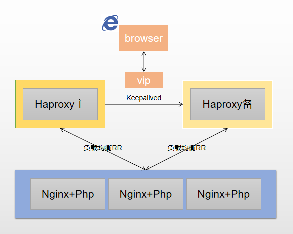
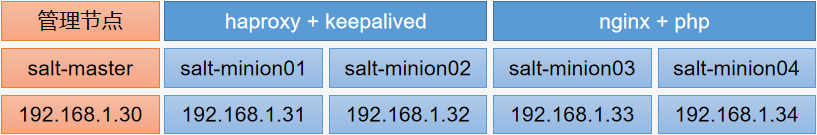

## 项目架构规划
>后端web服务器使用`Nginx+Php`作为站点，通过`HAproxy`做负载均衡，`Keepalived`做高可用



## 项目环境准备


**说明：** 关闭防火墙、`selinux`、时间同步等
`host`绑定
```
[root@salt-master ~]# cat /etc/hosts
127.0.0.1   localhost localhost.localdomain localhost4 localhost4.localdomain4
::1         localhost localhost.localdomain localhost6 localhost6.localdomain6
192.168.1.30	salt-master
192.168.1.31	salt-minion01
192.168.1.32	salt-minion02
192.168.1.33	salt-minion03
192.168.1.34	salt-minion04

[root@salt-master ~]# for i in `seq 4`; do scp /etc/hosts 192.168.1.3$i:/etc/hosts ; done
```
### 软件安装
[参考地址](https://www.cnblogs.com/yanjieli/p/10864648.html)
1）`Master`上软件安装
```
[root@salt-master ~]# yum -y install https://mirrors.aliyun.com/saltstack/yum/redhat/salt-repo-latest-2.el7.noarch.rpm
[root@salt-master ~]# sed -i "s/repo.saltstack.com/mirrors.aliyun.com\/saltstack/g" /etc/yum.repos.d/salt-latest.repo
[root@salt-master ~]# yum -y install salt-master
[root@salt-master ~]# systemctl enable salt-master
[root@salt-master ~]# systemctl start salt-master
```
2）`Minion`上软件安装并配置
```
# yum -y install https://mirrors.aliyun.com/saltstack/yum/redhat/salt-repo-latest-2.el7.noarch.rpm
# yum -y install salt-minion
# cp /etc/salt/minion{,.back}
# sed -i '/#master: /c\master: salt-master' /etc/salt/minion
# systemctl enable salt-minion
# systemctl start salt-minion
```
### Master上认证
```
[root@salt-master ~]# systemctl restart salt-master
[root@salt-master ~]# salt-key -L 
Accepted Keys:
Denied Keys:
Unaccepted Keys:
salt-minion01
salt-minion02
salt-minion03
salt-minion04
Rejected Keys:

[root@salt-master ~]# salt-key -A -y
The following keys are going to be accepted:
Unaccepted Keys:
salt-minion01
salt-minion02
salt-minion03
salt-minion04
Key for minion salt-minion01 accepted.
Key for minion salt-minion02 accepted.
Key for minion salt-minion03 accepted.
Key for minion salt-minion04 accepted.
[root@salt-master ~]# salt-key -L 
Accepted Keys:
salt-minion01
salt-minion02
salt-minion03
salt-minion04
Denied Keys:
Unaccepted Keys:
Rejected Keys:

[root@salt-master ~]# salt '*' test.ping
salt-minion01:
    True
salt-minion02:
    True
salt-minion03:
    True
salt-minion04:
    True
```
## Master上state编写
### state环境设置
>说明：该案例在`prod`环境下配置，在`prod`下面创建了一个`modules`的目录，所有的安装配置都放在这个目录下面了，里面分别又对应创建了对应的软件目录，每个软件目录下面的`files`目录用来存放的是软件包或者配置文件模板
```
[root@salt-master ~]# vim /etc/salt/master
file_roots:
  base:
    - /srv/salt/base
  test:
    - /srv/salt/test
  prod:
    - /srv/salt/prod
  dev:
    - /srv/salt/dev
[root@salt-master ~]# systemctl restart salt-master
[root@salt-master ~]# mkdir -p /srv/salt/{base,test,prod,dev}

[root@salt-master ~]# mkdir -p /srv/salt/prod/modules/{nginx,php,mysql,haproxy,keepalived,lnmp}/files
[root@salt-master ~]# mkdir /srv/salt/prod/modules/user
[root@salt-master ~]# tree /srv/salt/prod/modules/
/srv/salt/prod/modules/
├── haproxy
│   └── files
├── keepalived
│   └── files
├── lnmp
│   └── files
├── mysql
│   └── files
├── nginx
│   └── files
├── php
│   └── files
└── user

13 directories, 0 files
```
### sls文件编写
#### pkg基础包
安装源码编译所需要用到的基础软件包
```
[root@salt-master ~]# cat /srv/salt/prod/modules/pkg.sls 
pkg-install:
  pkg.installed:
    - pkgs:
      - gcc
      - gcc-c++
      - make
      - autoconf
      - glibc
      - glibc-devel
      - glib2
      - glib2-devel
      - pcre
      - pcre-devel
      - zlib
      - zlib-devel
      - openssl
      - openssl-devel
      - libpng
      - libpng-devel
      - freetype
      - freetype-devel
      - libxml2
      - libxml2-devel
      - bzip2
      - bzip2-devel
      - ncurses
      - curl
      - gdbm-devel
      - libXpm-devel
      - libX11-devel
      - gd-devel
      - gmp-devel
      - readline-devel
      - libxslt-devel
      - expat-devel
      - xmlrpc-c
      - xmlrpc-c-devel
```
#### useradd
创建网站运行用户
```
[root@salt-master ~]# cat /srv/salt/prod/modules/user/www.sls 
www-user-group:
  group.present:
    - name: www
    - gid: 2000

  user.present:
    - name: www
    - fullname: www
    - shell: /sbin/nologin
    - uid: 2000
    - gid: 2000
    - unless: id www
```
#### nginx
1）软件包准备，及配置文件模板，启动文件模板
```
[root@salt-master ~]# cd /srv/salt/prod/modules/nginx/
[root@salt-master nginx]# tree 
.
├── files
│   ├── nginx-1.12.2.tar.gz
│   ├── nginx-1.16.0.tar.gz
│   ├── nginx.conf.template
│   └── nginx.service.template
├── install.sls
└── service.sls

1 directory, 6 files
```
2）`install.sls` 
```
[root@salt-master nginx]# cat install.sls 

include:
  - modules.pkg
  - modules.user.www

nginx-install:
  file.managed:
    - name: /usr/local/src/nginx-{{ nginx_version }}.tar.gz
    - source: salt://modules/nginx/files/nginx-{{ nginx_version }}.tar.gz
    - user: root
    - group: root
    - mode: 644

  cmd.run:
    - name: cd /usr/local/src/ && tar xf nginx-{{ nginx_version }}.tar.gz && cd nginx-{{ nginx_version }} && ./configure --prefix=/usr/local/nginx-{{ nginx_version }} --user=root --group=root --with-http_ssl_module --with-stream --with-http_stub_status_module --with-file-aio --with-http_gzip_static_module && make && make install && ln -s /usr/local/nginx-{{ nginx_version }} /usr/local/nginx
    - unless: test -d /usr/local/nginx-{{ nginx_version }} && test -L /usr/local/nginx
    - require:
      - file: nginx-install
      - pkg: pkg-install
```
3）`service.sls`
```
[root@salt-master nginx]# cat service.sls 
#引入nginx安装sls
include:
  - modules.nginx.install

#添加systemctl
nginx-init:
  file.managed:
    - name: /usr/lib/systemd/system/nginx.service
    - source: salt://modules/nginx/files/nginx.service.template
    - user: root
    - group: root
    - mode: 755
    - unless: test -f /usr/lib/systemd/system/nginx.service
  cmd.run:
    - name: systemctl daemon-reload
    - require:
      - file: nginx-init

#配置文件
/usr/local/nginx/conf/nginx.conf:
  file.managed:
    - source: salt://modules/nginx/files/nginx.conf.template
    - user: root
    - group: root
    - mode: 644

#启动nginx
nginx-service:
  file.directory:
    - name: /usr/local/nginx/conf/conf.d
    - user: root
    - group: root
    - mode: 755
    - require:
      - cmd: nginx-install
  service.running:
    - name: nginx
    - enable: True
    - reload: True
    - require:
      - cmd: nginx-init
    - watch:
      - file: /usr/local/nginx/conf/nginx.conf
      - file: nginx-service
```
#### php
1）软件包准备，及配置文件模板，启动文件模板
```
[root@salt-master ~]# cd /srv/salt/prod/modules/php/
[root@salt-master php]# tree
.
├── files
│   ├── php-5.6.40.tar.gz
│   ├── php-fpm.conf.template
│   ├── php-fpm.service.template
│   ├── php-fpm.template
│   └── php.ini.template
├── install.sls
└── service.sls

1 directory, 7 files
```
2）`install.sls`
```
[root@salt-master php]# cat install.sls 

include:
  - modules.pkg

php-install:
  file.managed:
    - name: /usr/local/src/php-{{ php_version }}.tar.gz
    - source: salt://modules/php/files/php-{{ php_version }}.tar.gz
    - user: root
    - group: root
    - mode: 644

  cmd.run:
    - name: cd /usr/local/src/ && tar xf php-{{ php_version }}.tar.gz && cd php-{{ php_version }} && ./configure --prefix=/usr/local/php-{{ php_version }} --with-curl --with-freetype-dir --with-gd --with-gettext --with-iconv-dir --with-jpeg-dir --with-kerberos --with-libdir=lib64 --with-libxml-dir --with-mysql --with-mysqli --with-openssl --with-pcre-regex --with-pdo-mysql --with-dpo-sqlite --with-pear --with-png-dir --with-openssl --with-xmlrpc --with-xsl --with-zlib --enable-fpm --enable-bcmath --enable-libxml --enable-inline-optimization --enable-gd-native-ttf --enable-mbregex --enable-mbstring --enable-opcache --enable-pcntl --enable-shmop --enable-soap --enable-sockets --enable-sysvsem --enable-xml --enable-zip && make && make install && ln -s /usr/local/php-{{ php_version }} /usr/local/php
    - unless: test -d /usr/local/php-{{ php_version }} && test -L /usr/local/php
    - require:
      - file: php-install
      - pkg: pkg-install
```
3）`service.sls`
```
[root@salt-master php]# cat service.sls 
#引入php安装的sls
include:
  - modules.php.install

#php-ini配置文件配置
php-ini:
  file.managed:
    - name: /usr/local/php/etc/php.ini
    - source: salt://modules/php/files/php.ini.template
    - user: root
    - group: root
    - mode: 644
    - require:
      - cmd: php-install
  cmd.run:
    - name: ln -s /usr/local/php/etc/php.ini /etc/php.ini
    - unless: test -L /etc/php.ini
    - require:
      - file: php-ini

#php-fpm配置文件配置
php-fpm:
  file.managed:
    - name: /usr/local/php/etc/php-fpm.conf
    - source: salt://modules/php/files/php-fpm.conf.template
    - user: root
    - group: root
    - mode: 644
    - require:
      - cmd: php-install
  cmd.run:
    - name: ln -s /usr/local/php/etc/php-fpm.conf /etc/php-fpm.conf
    - unless: test -L /etc/php-fpm.conf
    - require:
      - file: php-fpm

#加入system启动
php-systemd:
  file.managed:
    - name: /usr/lib/systemd/system/php-fpm.service
    - source: salt://modules/php/files/php-fpm.service.template
    - user: root
    - group: root
    - mode: 644
    - require:
      - cmd: php-install

#加入/etc/init.d/启动
php-init:
  file.managed:
    - name: /etc/init.d/php-fpm
    - source: salt://modules/php/files/php-fpm.template
    - user: root
    - group: root
    - mode: 755
    - require:
      - cmd: php-install

#启动php-fpm
php-service:
  service.running:
    - name: php-fpm
    - enable: True
    - require:
      - file: php-systemd
    - watch:
      - file: php-fpm
      - file: php-ini
```
#### mysql
1）配置文件模板准备
```
[root@salt-master ~]# cd /srv/salt/prod/modules/mysql/
[root@salt-master mysql]# tree
.
├── files
│   └── my.cnf
├── install.sls
└── service.sls

1 directory, 3 files
```
2）`install.sls`
```
[root@salt-master mysql]# cat install.sls 
mariadb-install:
  pkg.installed:
    - pkgs:
      - mariadb-server
      - mariadb
```
3）`service.sls`
```
[root@salt-master mysql]# cat service.sls 
#引入mysql安装的sls
include:
  - modules.mysql.install

#my.cnf配置文件
mariadb-config:
  file.managed:
    - name: /etc/my.cnf
    - source: salt://modules/mysql/files/my.cnf
    - user: root
    - group: root
    - mode: 644
    - require:
      - pkg: mariadb-install

#启动mariadb
mariadb-service:
  service.running:
    - name: mariadb
    - enable: True
    - watch:
      - file: mariadb-config
    - require:
      - pkg: mariadb-install
      - file: mariadb-config
```
#### lnmp
1）准备测试文件`php info` 和`nginx`虚拟主机配置文件
```
[root@salt-master ~]# cd /srv/salt/prod/modules/lnmp/
[root@salt-master lnmp]# tree
.
├── files
│   ├── index.php
│   └── www.conf
└── www.sls

1 directory, 3 files
```
2）`www.sls`
```
[root@salt-master lnmp]# cat www.sls 
#引入nginx、php、mysql的安装
include:
  - modules.nginx.service
  - modules.php.service
  - modules.mysql.service

#虚拟主机web站点目录创建
web-www:
  file.directory:
    - name: /opt/www
    - user: www
    - group: www
    - mode: 755

#虚拟主机配置文件配置
web-www-conf:
  file.managed:
    - name: /usr/local/nginx/conf/conf.d/www.conf
    - source: salt://modules/lnmp/files/www.conf
    - user: root
    - group: root
    - mode: 644
    - require:
      - file: web-www
    - watch_in:
      - service: nginx-service
    - template: jinja
    - defaults:
      PORT: 80
      IPADDR: {{ grains['fqdn_ip4'][0] }}

#phpinfo测试文件准备
web-index:
  file.managed:
    - name: /opt/www/index.php
    - source: salt://modules/lnmp/files/index.php
    - user: www
    - group: www
    - mode: 644
```
#### 测试lnmp是否OK
1）`Top file`编写
```
[root@salt-master ~]# cat /srv/salt/base/top.sls 
prod:
  "salt-minion0[3-4]":
    - modules.lnmp.www
```
2）执行高级状态
```
[root@salt-master ~]# salt '*' state.highstate
```
3）访问测试


#### haproxy
1）配置文件准备
```
[root@salt-master ~]# cd /srv/salt/prod/modules/haproxy/
[root@salt-master haproxy]# tree
.
├── files
│   └── haproxy.cfg
├── install.sls
└── service.sls

1 directory, 3 files
```
2）`install.sls`
```
[root@salt-master haproxy]# cat install.sls 
haproxy-install:
  pkg.installed:
    - name: haproxy
```
3）`service.sls`
```
[root@salt-master haproxy]# cat service.sls 
#引入haproxy安装的sls
include:
  - modules.haproxy.install

#配置文件
haproxy-config:
  file.managed:
    - name: /etc/haproxy/haproxy.cfg
    - source: salt://modules/haproxy/files/haproxy.cfg
    - user: root
    - group: root
    - mode: 644
    - require:
      - pkg: haproxy-install

#启动haproxy
haproxy-service:
  service.running:
    - name: haproxy
    - enable: True
    - require:
      - pkg: haproxy-install
      - file: haproxy-config
    - watch:
      - file: haproxy-config
```
#### keepalived
1）配置文件准备
```
[root@salt-master ~]# cd /srv/salt/prod/modules/keepalived/
[root@salt-master keepalived]# tree
.
├── files
│   └── keepalived.conf
├── install.sls
└── service.sls

1 directory, 3 files
```
2）`install.sls`
```
[root@salt-master keepalived]# cat install.sls 
keepalived-install:
  pkg.installed:
    - name: keepalived
```
3）`service.sls`
```
[root@salt-master keepalived]# cat service.sls 
#引入keepalived安装的sls
include:
  - modules.keepalived.install

#keepalived配置文件
keepalived-config:
  file.managed:
    - name: /etc/keepalived/keepalived.conf
    - source: salt://modules/keepalived/files/keepalived.conf
    - user: root
    - group: root
    - mode: 644
    - require:
      - pkg: keepalived-install
    - template: jinja
    - defaults:

      ROUTER_ID: saltstack01
      STATE: MASTER
      PRIORITY: 150

      ROUTER_ID: saltstack02
      STATE: BACKUP
      PRIORITY: 100


#启动keepalived
keepalived-service:
  service.running:
    - name: keepalived
    - enable: True
    - require:
      - pkg: keepalived-install
      - file: keepalived-config
    - watch:
      - file: keepalived-config
```
### 整体部署
1）top file 编写
```
[root@salt-master ~]# cat /srv/salt/base/top.sls 
prod:
  "salt-minion0[3-4]":
    - modules.lnmp.www

  "salt-minion0[1-2]":
    - modules.haproxy.service
    - modules.keepalived.service
```
2）高级状态执行
```
[root@salt-master ~]# salt '*' state.highstate
```
3）测试
访问`192.168.1.31`和`192.168.1.32`的状态页


访问VIP`192.168.1.100`


通过上面测试可看到可以成功访问`lnmp`站点，并且`haproxy`也`ok`。访问所有四台服务器都可以得到`phpinfo`页面，而在生产环境中，我们只是对外提供`vip`即可。
## 项目总结
1）整体环境查看
```
[root@salt-master ~]# tree /srv/salt/prod/modules/
/srv/salt/prod/modules/
├── haproxy
│   ├── files
│   │   └── haproxy.cfg
│   ├── install.sls
│   └── service.sls
├── keepalived
│   ├── files
│   │   └── keepalived.conf
│   ├── install.sls
│   └── service.sls
├── lnmp
│   ├── files
│   │   ├── index.php
│   │   └── www.conf
│   └── www.sls
├── mysql
│   ├── files
│   │   └── my.cnf
│   ├── install.sls
│   └── service.sls
├── nginx
│   ├── files
│   │   ├── nginx-1.12.2.tar.gz
│   │   ├── nginx-1.16.0.tar.gz
│   │   ├── nginx.conf.template
│   │   └── nginx.service.template
│   ├── install.sls
│   └── service.sls
├── php
│   ├── files
│   │   ├── php-5.6.40.tar.gz
│   │   ├── php-fpm.conf.template
│   │   ├── php-fpm.service.template
│   │   ├── php-fpm.template
│   │   └── php.ini.template
│   ├── install.sls
│   └── service.sls
├── pkg.sls
└── user
    └── www.sls

13 directories, 27 files
```
2）如果需要在某台服务器上面单独部署某一部分，参考以下写法：
```
[root@salt-master ~]# cat /srv/salt/base/top.sls 
#部署lnmp及haproxy+keepalived
prod:
  "salt-minion0[3-4]":
    - modules.lnmp.www

  "salt-minion0[1-2]":
    - modules.haproxy.service
    - modules.keepalived.service

#单实例操作说明：
prod:
  "salt-minion04":
    - modules.nginx.service	#单独安装nginx时
    - modules.mysql.service     #单独安装mysql时
    - modules.php.service       #单独安装php时
    - modules.keepalived.service  #单独安装keepalived时
    - modules.haproxy.service   #单独安装haproxy时

  "salt-minion03":
    - modules.lnmp.www     #单独部署lnmp环境时
```
